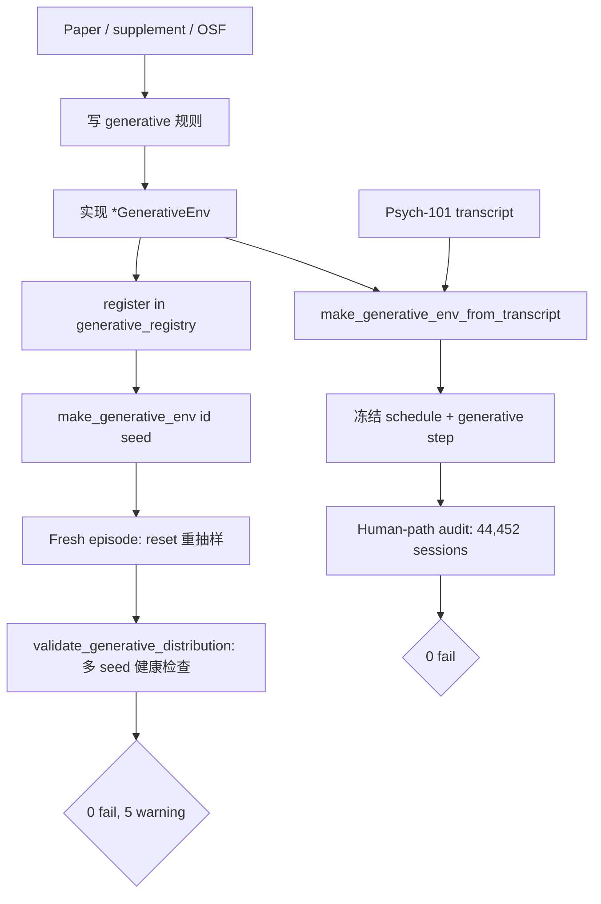

# PsycEnvir Generative 工作总结

只覆盖 **generative env** 这条线：从规则定义 → 实现 → 验收。不含 policy eval、session texts、recorded-only TaskEnv 等其它 track。

相关设计细节见 [`SIMENV_DESIGN.md`](SIMENV_DESIGN.md) §2.8、§8.9。

---

## 1. 目标与两条路径

Psych-101 共 76 个 experiment。Generative 的目标是：

> **按 paper/source 写清规则，`reset(seed)` 每场新抽样；`step(action)` 由状态 + 动作 + RNG 产生人类可见反馈。**

与 recorded 路径的区别：

| 路径 | 入口 | 刺激 / schedule | 用途 |
|------|------|-----------------|------|
| **Fresh generative** | `make_generative_env(id, seed=…)` | 每场重抽 | 可重玩的新 episode |
| **Transcript-bound generative audit** | `make_generative_env_from_transcript(id, text)` | **冻结** transcript 的 trial 序列 | 验收 `step()` 是否正确（详见 §4） |
| Recorded exact | `make_task_env(text)` | 完全 replay | 已退出 generative audit 主路径 |

核心原则（§2.8.2）：

1. **先 paper 建规则，再用 transcript 验收** — transcript 是 oracle，不是规则唯一来源。
2. Deterministic 任务：`state + action` → 固定 feedback。
3. Stochastic 任务：paper 给分布；transcript 绑定的是 **observed random draw**，不要求 fresh seed 复现同一条轨迹。
4. Paper 给不全 setting → **unsupported**，不注册 fresh generative。

---

## 2. 分级：谁能承诺 generative？

机器可读清单：[`data/generated/generative_setting_tiers.yaml`](../data/generated/generative_setting_tiers.yaml)

| 分级 | 数量 | 含义 |
|------|------|------|
| **Tier A** | 58 / 76 | Paper/source 能写清整场 generative 规则；**必须**注册 `make_generative_env` |
| **Tier C** | 18 / 76 | 暂不承诺 fresh generative（缺刺激库、非 press 接口、schematic 实现、setting 未清等） |

Tier C 典型原因：`hebart`（THINGS DB）、`jansen` / `kumar` / `levering` / `zhu` / `wise`（typed 接口）、`tomov`（图结构 schematic）、`collsi exp2`、`popov` 等。

验收：`tests/test_generative_setting_tier_a.py` — 全部 Tier A 必须能 `make_generative_env`。

---

## 3. Fresh generative 的实现架构

### 3.1 注册与工厂

```
make_generative_env(experiment_id, seed=…, **kwargs)
  → generative_registry._GENERATIVE_BUILDERS[id](**kwargs)
  → GroundedGenerativeEnv 包装
```

| 组件 | 路径 |
|------|------|
| 注册表 | `src/psycenvir/core/generative_registry.py`（58 个 Tier A experiment） |
| 各任务实现 | `src/psycenvir/generative/*.py`（bandit、category、two-step、IGT、memory battery 等） |
| 统一 instruction | `src/psycenvir/generative/instructions.py` |
| 共享随机动力学 | `src/psycenvir/generative/dynamics.py` |

每个 env 的典型结构：

```
reset(seed)  → 按 paper 规则抽样整场 schedule（trial 数、刺激、隐变量、action labels）
step(action) → 合法动作检查 → 状态转移 → 渲染 observation + reward + info
```

### 3.2 Grounding 元数据

`GroundedGenerativeEnv` 在 `info` 里附带：

- `generative_grounding`：`paper_documented` | `transcript_calibrated` | `mixed` | `partial`
- `generative_sources`：论文 / Psych-101 等
- `generative_caveats`：已知与 transcript 不一致处

配置与校准：`src/psycenvir/generative/grounding.py` + `data/generated/generative_calibration.json`  
审计：`scripts/audit_generative_grounding.py` → `results/generative_grounding_audit.md`

### 3.3 代表性生成逻辑（v0）

| 实验族 | 生成逻辑要点 |
|--------|-------------|
| Badham | 4 problem × 88 trial；8 刺激因子；每 problem 随机维度的二分类规则 |
| Wu bandit | 16 env × 30 臂；空间平滑收益；重选臂带噪声 |
| Frey BART / CCT | 隐藏爆炸阈值 / 每轮洗牌 32 张 gain-loss 牌堆 |
| Kool two-step | 飞船 → 星球 → 外星人；宝藏 / 反物质 / 5× 倍率 |
| Peterson | 重采样 transcript payoff pairs（显示概率暂 0.5 占位 → `mixed`） |
| Wilson / exploration 族 | 多局双拉杆；instructed + 自由试次 |
| Collsi / Cox / Enkavi | 规则反馈 / 再认 / n-back / digit span / go-nogo |
| Wulff | description 明示概率 vs sampling 自由抽样 + 停止 |
| Schulz | 30 轮 × 8 选项；轮间潜变量重置 |

完整表见 `SIMENV_DESIGN.md` §2.8。

### 3.4 实验族 × experiment × 论文对照表

下表按 **实验族** 列出 Psych-101 中各 `experiment_id`、对应 **原论文**、**generative 实现类**、**Tier** 与当前 **fresh / audit** 状态。

图例：

| 列 | 含义 |
|----|------|
| **Tier** | `A` = 承诺 fresh generative；`C` = 暂不承诺（见 §2） |
| **Fresh** | 是否已注册 `make_generative_env` |
| **Audit** | 是否在 transcript-bound human-path audit 的 64 experiment 覆盖内 |

---

#### 类别学习（Category learning）

| experiment_id | 论文 | Generative 类 | Tier | Fresh | Audit |
|---------------|------|---------------|------|-------|-------|
| `badham2017deficits/exp1.csv` | Badham, Sanborn & Maylor (2017), *Psychology and Aging* | `BadhamGenerativeEnv` | A | ✓ | ✓ |

---

#### 规则判断 / MCPL（Judgment learning）

| experiment_id | 论文 | Generative 类 | Tier | Fresh | Audit |
|---------------|------|---------------|------|-------|-------|
| `collsiöö2023MCPL/exp1.csv` | Collsiö et al. (2023), MCPL judgment-learning | `CollsiJudgmentGenerativeEnv` | A | ✓ | ✓ |
| `collsiöö2023MCPL/exp2.csv` | Collsiö et al. (2023), MCPL（test 期 label 不可恢复） | — | C | — | — |
| `collsiöö2023MCPL/exp3.csv` | Collsiö et al. (2023), MCPL judgment-learning | `CollsiJudgmentGenerativeEnv` | A | ✓ | ✓ |

---

#### 赌博 / 风险选择（Gamble & risk）

| experiment_id | 论文 | Generative 类 | Tier | Fresh | Audit |
|---------------|------|---------------|------|-------|-------|
| `peterson2021using/exp1.csv` | Peterson et al. (2021), *Science*；复现方法 Thomas et al. (2024), *Nature Human Behaviour* (choices13k) | `PetersonGenerativeEnv` | A | ✓ | ✓ |
| `frey2017cct/exp1.csv` | Frey et al. (2017), *Science Advances*（Columbia Card Task） | `FreyCCTGenerativeEnv` | A | ✓ | ✓ |
| `frey2017risk/exp1.csv` | Frey et al. (2017), *Science Advances*（BART 风险电池） | `FreyRiskBalloonGenerativeEnv` | A | ✓ | ✓ |
| `plonsky2018when/exp1.csv` | Plonsky et al. (2018), risk-seeking 时变赌博 | `PlonskyGambleGenerativeEnv` | A | ✓ | ✓ |
| `krueger2022identifying/exp1.csv` | Krueger et al. (2022), identifying good decisions | `KruegerIdentifyingGenerativeEnv` | A | ✓ | ✓ |
| `wulff2018description/exp1.csv` | Wulff et al. (2018), description–experience gap（明示概率选择） | `WulffDescriptionGenerativeEnv` | A | ✓ | ✓ |
| `wulff2018sampling/exp1.csv` | Wulff et al. (2018), description–experience gap（抽样后选择） | `WulffSamplingGenerativeEnv` | A | ✓ | ✓ |
| `hilbig2014generalized/exp1.csv` | Hilbig (2014), generalized outcome-based strategy | `HilbigProductGenerativeEnv` | A | ✓ | ✓ |
| `ruggeri2022globalizability/exp1.csv` | Ruggeri et al. (2022), decision preferences 跨文化可泛化性 | `RuggeriGlobalizabilityGenerativeEnv` | A | ✓ | ✓ |

---

#### 多臂 / 空间 Bandit（Bandit & spatial search）

| experiment_id | 论文 | Generative 类 | Tier | Fresh | Audit |
|---------------|------|---------------|------|-------|-------|
| `wu2018generalisation/exp1.csv` | Wu et al. (2018), *Nature Human Behaviour*（空间平滑 bandit） | `WuSpatialBanditGenerativeEnv` | A | ✓ | ✓ |
| `bahrami2020four/exp.csv` | Bahrami et al. (2020), four-arm bandit | `BahramiFourArmGenerativeEnv` | A | ✓ | ✓ |
| `lefebvre2017behavioural/exp1.csv` | Lefebvre et al. (2017), behavioural diversity of exploration | `CasinoBanditGenerativeEnv` | A | ✓ | ✓ |
| `lefebvre2017behavioural/exp2.csv` | Lefebvre et al. (2017), behavioural diversity of exploration | `CasinoBanditGenerativeEnv` | A | ✓ | ✓ |
| `schulz2020finding/exp1.csv` | Schulz et al. (2020), finding structure in bandit tasks | `SchulzFindingGenerativeEnv` | A | ✓ | ✓ |
| `schulz2020finding/exp2.csv` | 同上 | `SchulzFindingGenerativeEnv` | A | ✓ | ✓ |
| `schulz2020finding/exp3.csv` | 同上 | `SchulzFindingGenerativeEnv` | A | ✓ | ✓ |
| `schulz2020finding/exp4.csv` | 同上 | `SchulzFindingGenerativeEnv` | A | ✓ | ✓ |
| `schulz2020finding/exp5.csv` | 同上 | `SchulzFindingGenerativeEnv` | A | ✓ | ✓ |
| `ludwig2023human/exp0.csv` | Ludwig et al. (2023), human-like fruit market bandit | `LudwigFruitMarketGenerativeEnv` | A | ✓ | ✓ |
| `ludwig2023human/exp1.csv` | 同上 | `LudwigFruitMarketGenerativeEnv` | A | ✓ | ✓ |
| `ludwig2023human/exp2.csv` | 同上 | `LudwigFruitMarketGenerativeEnv` | A | ✓ | ✓ |
| `xiong2023neural/exp1.csv` | Xiong et al. (2023), hazard / non-stationary bandit | `XiongHazardBanditGenerativeEnv` | A | ✓ | ✓ |

---

#### 探索 / 双拉杆（Exploration & two-arm slot）

共用 `TwoArmSlotGenerativeEnv`（Wilson 范式；各 experiment 参数不同）。

| experiment_id | 论文 | Tier | Fresh | Audit |
|---------------|------|------|-------|-------|
| `wilson2014humans/exp1.csv` | Wilson et al. (2014), humans use directed exploration | A | ✓ | ✓ |
| `wilson2014humans/exp2.csv` | 同上 | A | ✓ | ✓ |
| `wilson2014humans/exp3.csv` | 同上 | A | ✓ | ✓ |
| `wilson2014humans/exp4.csv` | 同上 | A | ✓ | ✓ |
| `wilson2014humans/exp5.csv` | 同上 | A | ✓ | ✓ |
| `feng2021dynamics/exp1.csv` | Feng et al. (2021), dynamics of exploration | A | ✓ | ✓ |
| `sadeghiyeh2020temporal/exp1.csv` | Sadeghiyeh et al. (2020), temporal dynamics of exploration | A | ✓ | ✓ |
| `somerville2017charting/exp1.csv` | Somerville et al. (2017), charting the evolution of exploration | A | ✓ | ✓ |
| `waltz2020differential/exp1.csv` | Waltz et al. (2020), differential exploration | A | ✓ | ✓ |
| `levering2020revisiting/exp1.csv` | Levering et al. (2020), revisiting directed exploration | C | — | — |
| `levering2020revisiting/exp2.csv` | 同上 | C | — | — |
| `kumar2023disentangling/exp1.csv` | Kumar et al. (2023), disentangling exploration | C | — | — |

---

#### 两步任务 / 强化学习（Two-step RL）

| experiment_id | 论文 | Generative 类 | Tier | Fresh | Audit |
|---------------|------|---------------|------|-------|-------|
| `kool2016when/exp1.csv` | Kool et al. (2016), when to explore（飞船→星球） | `KoolWhenExp1GenerativeEnv` | A | ✓ | ✓ |
| `kool2016when/exp2.csv` | Kool et al. (2016), when to explore（飞船→星球→外星人） | `KoolWhenExp2GenerativeEnv` | A | ✓ | ✓ |
| `kool2017cost/exp1.csv` | Kool et al. (2017), effort/cost two-step（exp1） | `KoolCostExp1GenerativeEnv` | A | ✓ | ✓ |
| `kool2017cost/exp2.csv` | Kool et al. (2017), effort/cost two-step（exp2） | `KoolCostExp2GenerativeEnv` | A | ✓ | ✓ |
| `zorowitz2023data/exp1.csv` | Zorowitz et al. (2023), data-driven two-step analysis | `ZorowitzSpaceTreasureGenerativeEnv` | A | ✓ | ✓ |

---

#### Gershman _bandit / 映射学习_

| experiment_id | 论文 | Generative 类 | Tier | Fresh | Audit |
|---------------|------|---------------|------|-------|-------|
| `gershman2018deconstructing/exp1.csv` | Gershman et al. (2018), deconstructing human randomness（volatile + 0 臂） | `GershmanVolatileBanditGenerativeEnv` | A | ✓ | ✓ |
| `gershman2018deconstructing/exp2.csv` | Gershman et al. (2018), deconstructing human randomness（双可变臂） | `GershmanCompetitiveBanditGenerativeEnv` | A | ✓ | ✓ |
| `gershman2020reward/exp1.csv` | Gershman et al. (2020), reward learning and generalization | `GershmanMappingGenerativeEnv` | A | ✓ | ✓ |

---

#### 天气预测 / 概率学习（Weather prediction）

| experiment_id | 论文 | Generative 类 | Tier | Fresh | Audit |
|---------------|------|---------------|------|-------|-------|
| `speekenbrink2008learning/exp1.csv` | Speekenbrink & Shanks (2008), weather prediction task | `SpeekenbrinkWeatherGenerativeEnv` | A | ✓ | ✓ |

---

#### Iowa 赌博 / IGT（Iowa Gambling Task）

| experiment_id | 论文 | Generative 类 | Tier | Fresh | Audit |
|---------------|------|---------------|------|-------|-------|
| `steingroever2015data/exp1.csv` | Steingroever et al. (2015), IGT 数据/建模（H/V/J/D 牌组） | `SteingroeverIGTGenerativeEnv` | A | ✓ | ✓ |
| `steingroever2015data/exp2.csv` | 同上（U/F/I/S 牌组变体） | `SteingroeverIGTGenerativeEnv` | A | ✓ | ✓ |
| `steingroever2015data/exp3.csv` | 同上（U/F/I/S，另一 instruction） | `SteingroeverIGTGenerativeEnv` | A | ✓ | ✓ |

---

#### 结构发现 / 规划（Structure discovery & planning）

| experiment_id | 论文 | Generative 类 | Tier | Fresh | Audit |
|---------------|------|---------------|------|-------|-------|
| `tomov2020discovery/exp2.csv` | Tomov et al. (2020), structure discovery（地铁导航） | `TomovSubwayGenerativeEnv`（schematic；**Tier C**） | C | recorded audit only | ✓ |
| `tomov2020discovery/exp4.csv` | 同上 | 同上 | C | recorded audit only | ✓ |
| `tomov2020discovery/exp5.csv` | 同上 | 同上 | C | recorded audit only | ✓ |
| `tomov2020discovery/exp7.csv` | 同上 | 同上 | C | recorded audit only | ✓ |
| `tomov2021multitask/exp1.csv` | Tomov et al. (2021), multitask structure learning（城堡） | `TomovCastleGenerativeEnv`（schematic；**Tier C**） | C | recorded audit only | ✓ |
| `tomov2021multitask/exp3.csv` | 同上 | 同上 | C | recorded audit only | ✓ |

> Tomov 族：fresh 实现含 schematic graph，已从 Tier A 降为 **Tier C**；transcript-bound audit 仍可通过 `sim.*` exact backend 覆盖。

---

#### 经验 / 描述学习（Experiential vs described）

| experiment_id | 论文 | Generative 类 | Tier | Fresh | Audit |
|---------------|------|---------------|------|-------|-------|
| `garcia2023experiential/exp1.csv` | Garcia et al. (2023), experiential vs described learning | `GarciaExperientialGenerativeEnv` | A | ✓ | ✓ |
| `garcia2023experiential/exp2.csv` | 同上 | `GarciaExperientialGenerativeEnv` | A | ✓ | ✓ |
| `garcia2023experiential/exp3.csv` | 同上 | `GarciaExperientialGenerativeEnv` | A | ✓ | ✓ |
| `garcia2023experiential/exp4.csv` | 同上 | `GarciaExperientialGenerativeEnv` | A | ✓ | ✓ |
| `flesch2018comparing/exp1.csv` | Flesch et al. (2018), comparing exploration strategies（植树任务） | `FleschTreeGenerativeEnv` | A | ✓ | ✓ |

---

#### 情景记忆电池（Episodic memory battery）

| experiment_id | 论文 | Generative 类 | Tier | Fresh | Audit |
|---------------|------|---------------|------|-------|-------|
| `cox2017information/exp1.csv` | Cox et al. (2017), information and episodic memory（词对再认等） | `CoxPairRecognitionGenerativeEnv` | A | ✓ | ✓ |

---

#### Enkavi 认知任务电池（Cognitive battery）

来源合集：Enkavi et al. (2019) 大样本在线认知评估（Psych-101 收录各子任务）。

| experiment_id | 论文 / 任务 | Generative 类 | Tier | Fresh | Audit |
|---------------|-------------|---------------|------|-------|-------|
| `enkavi2019recentprobes/exp1.csv` | Enkavi et al. (2019), recent-probes working memory | `EnkaviRecentProbesGenerativeEnv` | A | ✓ | ✓ |
| `enkavi2019digitspan/exp1.csv` | Enkavi et al. (2019), digit span | `EnkaviDigitSpanGenerativeEnv` | A | ✓ | ✓ |
| `enkavi2019gonogo/exp1.csv` | Enkavi et al. (2019), go/no-go | `EnkaviGonogoGenerativeEnv` | A | ✓ | ✓ |
| `enkavi2019adaptivenback/exp1.csv` | Enkavi et al. (2019), adaptive n-back | `EnkaviAdaptiveNBackGenerativeEnv` | A | ✓ | ✓ |

---

#### 序列学习（Sequence learning）

| experiment_id | 论文 | Generative 类 | Tier | Fresh | Audit |
|---------------|------|---------------|------|-------|-------|
| `wu2023chunking/exp1.csv` | Wu et al. (2023), chunking in sequence learning | `WuChunkingGenerativeEnv` | A | ✓ | ✓ |
| `wu2023chunking/exp2.csv` | 同上 | `WuChunkingGenerativeEnv` | A | ✓ | ✓ |

---

#### 概念相似 / 自报告（Tier C：非标准 press 或缺外源库）

| experiment_id | 论文 | 阻塞原因 | Tier | Fresh | Audit |
|---------------|------|----------|------|-------|-------|
| `hebart2023things/exp1.csv` | Hebart et al. (2023), THINGS concept similarity（odd-one-out） | 需 THINGS 刺激库；试次常无标准 feedback 句 | C | — | — |
| `jansen2021dunningkruger/exp1.csv` | Jansen et al. (2021), Dunning–Kruger | 大量 `You say <<%>>` 自报告 | C | — | — |
| `popov2023intent/exp1.csv` | Popov et al. (2023), intent inference | setting 未清 / 未审 | C | — | — |
| `popov2023intent/exp2.csv` | 同上 | 同上 | C | — | — |
| `popov2023intent/exp3.csv` | 同上 | 同上 | C | — | — |
| `wise2019acomputational/exp1.csv` | Wise et al. (2019), computational psychiatry | 非标准 press 接口 | C | — | — |
| `zhu2020bayesian/exp1.csv` | Zhu et al. (2020), Bayesian RL / instruction following | typed 概率估计，非 press | C | — | — |
| `zhu2020bayesian/exp2.csv` | 同上 | 同上 | C | — | — |

---

#### 统计摘要

| 指标 | 数量 |
|------|------|
| Psych-101 experiment 总数 | 76 |
| Tier A（承诺 fresh generative） | 58 |
| Tier C（暂不承诺 fresh） | 18 |
| 已注册 `make_generative_env` | 58 |
| Transcript-bound audit 覆盖 | 64 |
| Audit 未覆盖（均为 Tier C） | 12 |

**Audit 未覆盖的 12 个**（与 Tier C 重合，非「Tier A 缺 adapter」）：

`collsiöö2023MCPL/exp2.csv`、`hebart2023things/exp1.csv`、`jansen2021dunningkruger/exp1.csv`、`kumar2023disentangling/exp1.csv`、`levering2020revisiting/exp1.csv`、`levering2020revisiting/exp2.csv`、`popov2023intent/exp1.csv`–`exp3.csv`、`wise2019acomputational/exp1.csv`、`zhu2020bayesian/exp1.csv`、`zhu2020bayesian/exp2.csv`。

---

## 4. Transcript human-path 验收逻辑

用 **Psych-101 人类 transcript** 验收 generative `step()` 是否正确。这是 generative 线的**主验收**；fresh distribution validation（§5）是补充。

### 4.1 验收目标

对每个 session 回答一个问题：

> 当本场 trial schedule **冻结为 transcript 里观察到的那条**时，按人类实际按下的动作逐步 `step()`，env 给出的 **reward / observation** 是否与 transcript 一致？

**不检查**：fresh `reset(seed)` 能否复现同一条轨迹（stochastic 任务不要求）、paper 聚合分布、policy 行为。

### 4.2 双通道 oracle

每个 session 走两条独立路径，再逐步对齐：

| 通道 | 做什么 | 代码 |
|------|--------|------|
| **Expectation oracle** | 仅从 `text` 解析人类动作序列 + 期望 reward / 观测片段 | `EXPECTATION_BUILDERS[id](text)` → `List[StepExpectation]` |
| **Generative env** | 从同一 `text` 冻结 schedule，但 `step()` 走 generative 规则 | `make_generative_env_from_transcript(id, text)` |

Expectation oracle **不调用 env**；env **不读预录 transition 表**。两者只在逐步输出上必须一致。

实现入口：

- `src/psycenvir/audit/transcript_human_path.py` — `audit_transcript_human_path`, `audit_jsonl`
- `src/psycenvir/generative/from_transcript.py` — schedule 冻结
- `src/psycenvir/generative/transcript_bound.py` — `TranscriptBoundAuditEnv` 包装
- `scripts/run_transcript_human_path_audit.py` — 全量 CLI

复杂任务（Tomov 图、Wulff 抽样边界、Kool topology 等）在 audit 时可能包一层 `sim.*` exact-transition backend，但对外仍标为 generative transcript-bound。

### 4.3 单 session 算法

`audit_transcript_human_path(experiment_id, text, session_index)`：

```
1. expectations ← EXPECTATION_BUILDERS[experiment_id](text)
2. env ← make_generative_env_from_transcript(experiment_id, text)
3. env.reset()
4. for step_idx, expected in enumerate(expectations):
       obs, reward, terminated, truncated, info ← env.step(expected.action)
       if truncated → 记录 issue，break
       if expected.expected_reward is not None:
           |reward - expected.expected_reward| > tolerance → issue
       for fragment in expected.observation_must_contain:
           fragment ∉ obs.lower() → issue
       for fragment in expected.observation_must_not_contain:
           fragment ∈ obs.lower() → issue
       if terminated and step_idx < len(expectations)-1 → issue（提前结束）
5. if 无 issue 且 expectations 非空 且 env 未 terminated → issue
6. ok = (issues 为空)
```

`expected.action` 一律来自 transcript 解析出的 **人类实际动作**（`human_action` / `human_key` / 抽样臂 / 飞船+外星人两步等），不是 counterfactual。

### 4.4 `StepExpectation` 字段

| 字段 | 含义 |
|------|------|
| `action` | 本步送入 `env.step()` 的动作 |
| `expected_reward` | 期望 reward；`None` 表示本步不核对数值（如仅检查观测） |
| `reward_tolerance` | 默认 `1e-6` |
| `observation_must_contain` | 观测子串必须出现（如 Flesch 有反馈时含 `"and get"`） |
| `observation_must_not_contain` | 观测子串不得出现（如 silent trial 不得含 `"and get"`） |

按实验族定制 expectation builder，例如：

- **标准 trial 列表**：`parse_*_trials` → 每 trial 一个 `StepExpectation(action=human_action, expected_reward=…)`
- **Flesch**：有/无 feedback 分支，silent 期 `reward=0` 且不得出现反馈句
- **Peterson**：Corr/Amb 块内按 `has_feedback` 区分 `"You receive"` 可见性
- **Kool exp2**：每 day 两步（飞船 `reward=0` + 外星人 `reward=宝藏数`）
- **Wulff sampling**：先逐次 sample 臂（观测含 `"observe"` / `"points"`），再 stop，再 final choice
- **Go/no-go**：`human_key` 或 `GONOGO_NO_PRESS`；按刺激类型判对错 → `reward ∈ {0,1}`
- **Digit span / Cox**：`reward = 1` 当且仅当 `human_action == correct_action`
- **Chunking / adaptive n-back / Collsi exp1**：regex 或块结构从 transcript 直接抽取

64 个 experiment 的 builder 注册在 `_build_expectation_registry()`（`audit/transcript_human_path.py`）。

### 4.5 全量 JSONL 跑法

数据源：`data/raw/prompts_training.jsonl`（每行 `{experiment, text, …}`）。

`audit_jsonl` 逻辑：

1. 预扫 jsonl，统计 **supported experiment** 的 session 总数（默认 **44,452**）。
2. 逐行读取；若 `experiment_id ∈ EXPECTATION_BUILDERS`，调用 `audit_transcript_human_path`。
3. 不在 registry 的 experiment **跳过**（Tier C / unsupported，不计 fail）。
4. 汇总 `per_experiment`: `{sessions, ok, failed, skipped, skipped_setup}`；失败样本最多保留 200 条。

CLI 与工程选项：

```bash
cd MindGYM     # 或 PsycEnvir 主仓
PYTHONPATH=src python scripts/run_transcript_human_path_audit.py \
  --output results/transcript_human_path_audit.json \
  --progress-every 1000          # 每 N session 打印进度
  # --resume                       # 从 .checkpoint.json 续跑
  # --max-per-experiment 10        # 调试：每实验最多 N 条
```

- **只走 generative**（无 `make_task_env` fallback）
- **checkpoint + `--resume`**：中断后可续跑；完成后自动删 checkpoint
- 进度行格式：`[transcript-audit] 1000/44452 sessions … ok=… fail=… eta=…`

### 4.6 明确不检查什么

| 不检查 | 原因 |
|--------|------|
| Fresh seed 复现同轨迹 | Stochastic 任务 transcript 绑定的是 **observed draw**，不是 RNG 种子 |
| Paper 聚合分布 | 属 §5 / 未来 paper-specific checks |
| Instruction 措辞逐字一致 | 只核对 step 级 reward / 关键观测片段 |
| Policy / LLM 行为 | 属 policy eval track |

### 4.7 当前结果

| 项目 | 结果 |
|------|------|
| Tier A fresh 注册 | **58 / 58** |
| Auditor 覆盖 | **64** 个 experiment |
| 全量 sessions | **44,452 / 44,452 通过（0 fail）** |
| 未覆盖 12 个 | 均为 Tier C / unsupported，非「A 缺 adapter」 |

| 运行环境 | 报告 | 备注 |
|----------|------|------|
| PsycEnvir 主仓 | `results/transcript_human_path_audit_latest4.json` | 2026-05-30 |
| MindGYM 导出副本 | `results/transcript_human_path_audit_mindgym.json` | 2026-06-14 复跑，~5 min，0 fail |

工程修复（audit 过程中暴露并修掉的典型问题）：Kool exp2 regex、Speekenbrink action、Frey risk session-local keys、Wu arm `0`、Krueger dynamic labels 等。

---

## 5. Fresh distribution validation

Transcript audit（§4）验证的是：**绑定 observed schedule 时规则对不对**。  
本节验证：**不绑 transcript、多 seed 抽样时 env 是否健康**。

| 项目 | 值 |
|------|-----|
| 脚本 | `scripts/validate_generative_distribution.py` |
| 报告 | `results/generative_distribution_validation.{md,json}` |
| 对象 | `generative_setting_tiers.yaml` 中全部 **Tier A**（58 个） |

### 5.1 验收逻辑

对每个 Tier A `experiment_id`，在多个 seed 上跑 **fresh** episode（`make_generative_env(id, seed=…, **compact_config)`，非 transcript-bound）：

```
1. env.reset(seed) → 检查 observation 为 str；info 含 generative_grounding、fidelity_level
2. 循环 step（最多 max_steps，默认 300）：
     action ← 从 observation/info/env 内部状态推断的合法动作候选（非人类 transcript）
     env.step(action)
     检查：observation 为 str；reward 为有限数值；invalid_action 未被接受
     记录轨迹 signature = hash(逐步 action:reward:obs 片段)
     若 terminated 或 truncated → 结束
3. 若步数用尽仍未结束 → warning「step budget exhausted」（episode 本身可能仍有效）
4. 汇总 per-experiment status
```

**与 §4 的区别**：这里 **不** 逐步对齐人类动作，也 **不** 要求 reward/obs 与某条 transcript 一致；只验证 fresh 抽样能否正常跑完、元数据齐全、随机任务有多样性。

### 5.2 判定规则

| status | 条件 |
|--------|------|
| **fail** | 任一 seed 的 `ok=False`（reset/step 异常、非有限 reward、接受 invalid action、缺 grounding metadata 等） |
| **warning** | 全部 seed `ok`，但出现：步数预算耗尽；action 候选用了 fallback；或多 seed **轨迹 signature 完全相同**（确定性任务） |
| **pass** | 全部 seed `ok`，无上述 warning |

| 结果 | 数量 |
|------|------|
| pass | 53 |
| warning | 5 |
| fail | 0 |

**Warning 项：**

- `feng2021dynamics`、`sadeghiyeh2020temporal`、`somerville2017charting`、`waltz2020differential`：episode 长于 300 步预算（rollout 本身有效）
- `ruggeri2022globalizability`：确定性 choice-only，多 seed 轨迹相同（符合预期）

**尚未做**：与 paper 聚合分布逐项对齐（trial 数、hazard rate、reward range 等）。

---

## 6. 代码地图

```
src/psycenvir/
  core/generative_registry.py     # make_generative_env 工厂
  generative/
    badham.py, wu_bandit.py, ...  # 各实验族 fresh 实现
    from_transcript.py            # transcript-bound audit env
    transcript_bound.py           # schedule 冻结包装
    grounding.py                  # grounding profile + 校准
    instructions.py               # canonical task instruction
    dynamics.py                   # 共享随机采样
  audit/transcript_human_path.py  # human-path generative audit

scripts/
  evaluate_generative.py              # 早期 smoke
  audit_generative_grounding.py       # grounding 审计
  run_transcript_human_path_audit.py  # 全量 transcript audit
  validate_generative_distribution.py # fresh 多 seed 健康检查

data/generated/
  generative_setting_tiers.yaml
  generative_calibration.json

tests/
  test_generative_setting_tier_a.py
  test_generative_envs.py
  test_generative_grounding.py
  test_transcript_generative_audit.py
  test_transcript_human_path_audit.py
  test_generative_distribution_validation.py
```

---

## 7. 逻辑流程



---

## 8. 已完成 vs 未完成（generative only）

### 已完成

- Tier A / C 分级与 58 个 fresh env 注册
- 全量 generative transcript-bound human-path audit（0 fail）
- Fresh distribution validation 第一轮（0 hard fail）
- Grounding profile + calibration + audit
- `from_transcript` 覆盖扩展到 64 个 experiment 的 audit
- Audit 基础设施：checkpoint、progress、generative-only

### 未完成 / 下一步

- **Paper-specific 分布验收**：stochastic Tier A 的 aggregate checks（非仅结构健康）
- **长 episode horizon**：feng / sadeghiyeh / somerville / waltz 等需 experiment-specific 步数预算
- **Tier C → A 升级**：Tomov 精确图生成器、Peterson Corr/Amb 联合采样、hebart THINGS 刺激库等
- **部分 `mixed` / `partial` grounding 消 caveat**：如 Peterson 显示概率、Frey money conversion
- **Env info 泄露**：如 Badham `step()` 的 `info` 含 `correct_action`（generative 暴露面问题）

---

## 9. 一句话

Generative 线已做到：**58 个 Tier A 能 fresh 抽样 + 44k sessions transcript-bound audit 全绿 + 多 seed 结构健康**。规则来源是 paper-first、transcript-oracle；更强结论还要补 paper 级分布对齐和部分 Tier C 任务的完整 setting。
