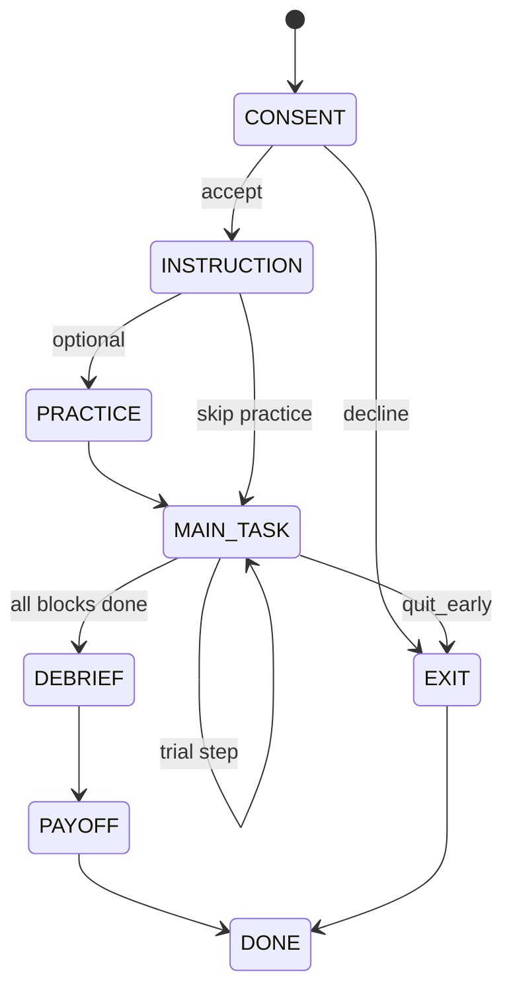

# PsycEnvir SimEnv 设计文档

> **版本**：v0.10（新增 generative full-sim：`make_generative_env`）  
> **范围**：基于 [Psych-101](https://huggingface.co/datasets/marcelbinz/Psych-101) 构建 **SimEnv**——**可玩的（playable）**、因果正确的文本实验环境：agent 的按键改变其读到的刺激与反馈。长远覆盖 consent → payoff 全流程（§5）；当前代码以 trial 级 `step` 为主。  
> **读者摘要**：[`PROJECT_STATUS_SUMMARY.md`](PROJECT_STATUS_SUMMARY.md)（目标 / 进度 / 问题，不依赖本文）。  
> **说明**：实现见仓库 `src/psycenvir/`；本文是设计而非 API 手册。ReplayEnv（按 transcript 回放、非因果）为对照基线，正文以 SimEnv 为主。

**代码入口与 SimEnv 的对应关系**：

| 设计概念 | 工厂函数 | 说明 |
|----------|----------|------|
| SimEnv（每场新抽样） | `make_generative_env(experiment_id, seed=…)` | §2.8；主路径的可重玩实现 |
| SimEnv（固定一场 schedule） | `make_task_env(experiment_id, text)` | 试次内 `exact_transition`；顺序来自该条 transcript |
| ReplayEnv（基线） | `make_replay_env(text)` | 始终播人类下一句，不用于因果 RL 训练 |

---

## 目录

1. [一句话摘要](#1-一句话摘要)
2. [为什么要做 SimEnv](#2-为什么要做-simenvir)
   - [2.4 Psych-101 数据事实（76 / 160 / 60k）](#24-psych-101-数据事实76--160--60k)
   - [2.5 「agent 选别的会怎样」从哪来？](#25-agent-选别的会怎样从哪来)
   - [2.6 试次反馈并不都一样少——类型与真实例句](#26-试次反馈并不都一样少类型与真实例句)
   - [2.7 ReplayEnv 定位（保留，不删）](#27-replayenv-定位保留不删)
   - [2.8 Generative full sim](#28-generative-full-simmake_generative_env2026-05-26)
3. [与 TextArena / Gym 精神的对齐](#3-与-textarena--gym-精神的对齐)
4. [研究的最终目标](#4-研究的最终目标)
5. [SimEnv 的边界：人类被试全流程](#5-simenvir-的边界人类被试全流程)
6. [系统架构概览](#6-系统架构概览)
7. [奖励、反馈与「无正确答案」实验](#7-奖励反馈与无正确答案实验)
8. [实验筛选与 SimEnv 适配清单](#8-实验筛选与-simenvir-适配清单)
   - [8.1 筛选原则](#81-筛选原则)
   - [8.2 全库自动扫描摘要（76 experiment）](#82-全库自动扫描摘要76-experiment)
   - [8.3 第一优先级：强烈建议 v1 做 Sim](#83-第一优先级强烈建议-v1-做-sim)
   - [8.4 第二优先级：值得做、需读论文/引擎化](#84-第二优先级值得做需读论文引擎化)
   - [8.5 第三优先级：v2 或专项](#85-第三优先级v2-或专项)
   - [8.6 建议暂缓 Sim（v1 仅 Replay）](#86-建议暂缓-simv1-仅-replay)
   - [8.7 与 shortcut 论文的实验对照](#87-与-shortcut-论文的实验对照)
   - [8.8 推荐 Roadmap（Phase 1–3）](#88-推荐-roadmapphase-13)
9. [详细实施计划](#9-详细实施计划)
10. [主要挑战与风险](#10-主要挑战与风险)
11. [搭建前必须再探讨的问题](#11-搭建前必须再探讨的问题)
12. [参考文献与链接](#12-参考文献与链接)

---

## 1. 一句话摘要

**SimEnv** 用可执行的实验规则（而非 Psych-101 里已发生的人类轨迹）驱动环境：agent 的每一步选择会改变它收到的刺激、反馈、积分与能否结束实验；在多 session / 多 episode 后，我们检验 agent 是否在**任务机制意义下**收敛到人类行为，并避免 Centaur 类模型仅靠 **choice history 捷径** 解释一切。

---

## 2. 为什么要做 SimEnv

### 2.1 Psych-101 与 Centaur 在做什么

[Psych-101](https://huggingface.co/datasets/marcelbinz/Psych-101) 将 160 个心理学实验、约 6 万被试的 **trial-by-trial 选择** 转写为自然语言；人类选择包在 `<<` `>>` 中。Centaur 在「任务描述 \(T\) + 选择历史 \(C_{1:t}\)」条件下做下一 token 预测，近似优化 \(P(C_{t+1} \mid C_{1:t}, T)\)（见 Binz et al., Nature 2025；[Centaur 项目页](https://marcelbinz.github.io/centaur)）。

这对 **预测** 人类数据很强，但对 **机制解释** 与 **干预泛化** 不够：模型可以在几乎看不到心理任务时，仍靠历史猜得不错。

### 2.2 本地复分析论文的核心论点（必读）

`Centaur_May_Have_Learned_a_Shortcut_that_Explains_Away_Psychological_Tasks.pdf`（Xie & Zhu）指出：

| 现象 | 含义 | 对环境的启示 |
|------|------|----------------|
| **顺序依赖强的任务**（如空间相关 bandit、多线索判断）：去掉任务描述、只留选择与极简指令，Centaur 仍优于领域认知模型 | 模型可能主要学 \(P(C_{t+1}\|C_{1:t})\)，而非任务结构 | 仅用 transcript **Replay** 训练/评测会**高估**「懂了任务」 |
| **非顺序任务**（多属性决策、THINGS odd-one-out）：去任务信息后性能接近 chance；zero-shot \(P(C\|T)\) 上 Centaur 不如小认知模型 | 任务信息在「无历史」时更重要 | SimEnv 必须让 **当前 trial 的刺激与规则** 决定反馈，而不能用人类那条世界线的反馈糊弄 agent |
| **道德决策等**：对实验操纵不敏感 | 用预测模型做理论推断可能误判「操纵无效」 | SimEnv 应支持 **对照条件**（改 cover story / 改反馈规则），看 agent 策略是否变 |
| **建议** | 训练上加强 zero-shot \(P(C\|T)\)；探索 **RL 微调** LLM 以解释人类决策（Zhu et al., arXiv:2505.11614） | **SimEnv 是 RL 与因果评测的基础设施**，不是 Psych-101 的可选附件 |

**结论**：若目标是「agent 在重复参与实验后，是否像人一样学会规则、风险偏好、探索策略」，必须做 **SimEnv**。若只做 ReplayEnv，本质上是在问「能否复现某条人类轨迹上的下一个 token」，与强化学习里的 **环境动力学** 不是一回事。

### 2.3 ReplayEnv vs SimEnv（对照表）

| 维度 | ReplayEnv | SimEnv（本文） |
|------|-----------|----------------|
| 刺激序列 | 固定来自某 participant 的 transcript | 来自 **实验设计**（可固定顺序、可随机、可新抽样） |
| 反馈 | 无论 agent 选什么，都播人类 session 里的下一句反馈 | 由 **状态 + agent 动作** 计算 |
| 适合的问题 | 行为克隆、与 Centaur 对齐的 NLL | 学习曲线、探索、干预、RL、机制检验 |
| 主要风险 | 虚假收敛、捷径学习不可见 | 实现成本高、需还原原始实验逻辑 |

### 2.4 Psych-101 数据事实（76 / 160 / 60k）

论文与 [HF 数据集页](https://huggingface.co/datasets/marcelbinz/Psych-101) 的计数**不是同一列**：

| 说法 | 数量 | 在数据里是什么 |
|------|------|----------------|
| Centaur / Nature 论文 | **160** 个心理学实验 | 研究设计层面的实验/条件计数（一篇研究里多个 task 可能各算一个） |
| HF 字段 `experiment` | **76** 个唯一 id | 数据文件路径，如 `badham2017deficits/exp1.csv`、`frey2017risk/exp1.csv` |
| HF 行数 `train` | **60,092** 行 | 每个被试 **一整场 session** 的完整 transcript（不是 60k 个实验） |
| 论文总选择数 | **约 1,068 万** | 所有 session 中 `<<人类按键>>` 的总和 |

**2025-05 对 parquet 全量扫描结果**（与 HF `num_rows: 60092` 一致）：

- `experiment` 去重 = **76**
- 每个 `experiment` 对应多行 = 多个真人被试（participant 编号在列 `participant`）
- 被试数极差大：最多 `peterson2021using/exp1.csv` **13,735** 人；最少 `wilson2014humans/exp2.csv` **7** 人
- 单场 session 的 trial 数（`You press` / `You say` 计数）因实验而异，粗范围约 **十几～数千**（如 category learning 一场约 **384** 步）

**HF 上只有 3 列**，没有单独的 trial 表：

```json
{
  "text": "整场实验的自然语言 transcript",
  "experiment": "76 个 id 之一",
  "participant": "该 experiment 内的被试编号（字符串）"
}
```

**每一行 `text` 里通常包含**（逐步决策相关）：

```text
[指导语 / 说明]
[试次 1：刺激描述] You press <<人类选择>>. [试次 1 反馈文案，若有]
[试次 2：刺激描述] You press <<人类选择>>. [试次 2 反馈文案，若有]
...
```

因此：

| 能力 | Psych-101 是否直接提供 |
|------|------------------------|
| 人类逐步选择 | ✅ 每个 trial 的 `<<key>>` / `You say <<…>>` |
| 该被试**实际经历**的反馈原文 | ✅ 多数实验有；少数实验试次间几乎无独立反馈句（见 §2.6） |
| 刺激与试次顺序（该被试） | ✅ 写在 transcript 中 |
| 结构化 `observation / action / reward` 列 | ❌ 需 `parse.py` 从 `text` 拆 |
| 完整「所有可选动作 → 下一状态」转移表 | ❌ 一般不提供 |

**和「环境个数」的对应关系**：

- **ReplayEnv 注册 id**：目标为 **76** 个。当前 parser 已扩展为回放所有 `<<...>>` 编码 action token（包括 `say that`、`choose`、`estimate`、复合 `predict`）；对 `press nothing` 等未编码 omission，仍需 cognitive-task 专项 action 表示才能达到完整 trial fidelity。
- **SimEnv**：≤ 76；v1 建议只做 **Tier 1 约 10–15** 个（能写清转移规则的）。本文的 `exact_transition` 表示在恢复的 source stimulus schedule 上任意合法动作可被因果计分；不自动意味着可脱离 transcript 采样全新 schedule。
- **160**：论文叙事用；工程上以 **76 个 `experiment` 字符串** 为准，必要时再按 block/条件拆细。

**Phase 0 建议产出**：`experiments_manifest.csv`（76 行：`n_participants`、平均 trial 数、反馈类型标签、`sim_tier`）。

---

### 2.5 「agent 选别的会怎样」从哪来？

**不只有**「写规则」或「回原论文 / 原始 trial CSV」两条路；但 **Psych-101 从未以结构化形式给出完整反事实表**。按信息来源可分五类：

| 来源 | 内容 | 何时够用 | 局限 |
|------|------|----------|------|
| **A. Transcript 中的任务反馈** | 反馈句只依赖刺激/世界状态，不依赖人类是否按对 | 分类（`correct category`）、部分判断题 | 仍缺「未选臂」的 outcome，除非文案写出 |
| **B. Transcript 中的结果反馈** | `press` 后给出点数、爆气球、翻牌等 | Bandit、风险、IOWA 类 | 需知随机种子或接受重新采样 |
| **C. Transcript 中的反事实句** | 明确写「若选另一选项会得到 …」 | **部分实验已有**（见下例 `peterson2021using`） | 只覆盖二选一；未选的臂有文案 |
| **D. 实验规则 + 代码/参数** | 从论文、OSF、作者代码恢复转移 \(P(s',r \mid s,a)\) | SimEnv 的**主路径** | 工作量大；需验证与 transcript 一致 |
| **E. 原始 trial-level CSV** | 每 trial 的 stimulus id、latent state、payoff | 与 Centaur 数据收集同源时最稳 | 不在 HF 里；需单独申请或爬 supplementary |

**结论（回答「只能靠规则或 CSV 吗」）**：

- **ReplayEnv**：不需要反事实——始终播放人类那条世界线在 `text` 里的下一句（即使用于评测，agent 选错也「看到」人类的反馈，因果不对）。
- **SimEnv**：必须用 **D（规则）** 或 **E（原始 CSV）** 才能让 agent 的动作**因果地**改变反馈；**A/B/C** 可帮助**反推和校验**规则，有时能直接拼出 Sim（例如类别反馈已在 transcript 里标出真值）。
- 少数实验（如 `peterson2021using`）在 **C** 意义上已在 NLP 文本里写了反事实，但仅限实验的 `Feedback=True` blocks；`Feedback=False` blocks 只记录动作。其反馈 blocks 足够支持**记录试次上的精确双动作反馈**，但不能代替依据 `Corr`/`Amb` 参数生成全新 outcome 序列的引擎。

校验流程建议：对每个 `experiment`，用 held-out participant 的 transcript 检查 `SimEnv.step(action_human)` 产生的反馈句是否与原文一致；一致后再测 `action ≠ human`。

---

### 2.6 试次反馈并不都一样少——类型与真实例句

**不是** 76 个实验都「很少 feedback」。Psych-101 是 76 种**不同范式**的混合；试次间反馈从「没有独立一句」到「每步点数 + 反事实」都有。粗分为五类（同一 experiment 可能混合多种 phase）：

| 类型 | 试次后 agent 看到什么 | Sim 难度 | 数据例（来自 HF transcript） |
|------|----------------------|----------|------------------------------|
| **F1 规范标签** | 客观正确答案/类别 | 低 | `badham2017deficits/exp1.csv`：`You see a big black square. You press <<K>>. The correct category is K.` |
| **F2 结果 / 点数** | 实现收益、损失、状态更新 | 中 | `peterson2021using/exp1.csv` 的反馈 block：`You press <<Z>>. You receive -11.0 points … You would have received -2.0 points had you chosen the other option.`；无反馈 block 只有 `You press <<...>>.` |
| **F3 随机结果（无唯一「对」）** | 抽样结果文案 | 中–高 | `frey2017risk/exp1.csv`：`You press <<R>>. The balloon was inflated too much and explodes.` |
| **F4 丰富状态机** | 多句反馈、轮次结束 | 中 | `frey2017cct/exp1.csv`：`You press <<O>> and turn over a loss card. Your current score is -75. The round has now ended …` |
| **F5 极简 / 无独立反馈句** | 按完即进入下一试次刺激 | 高（Sim 靠任务定义） | `hebart2023things/exp1.csv`：`T: bottle opener, Z: ironing board, and R: goalpost. You press <<R>>.` 下一句已是新 triplets，**无** `correct/incorrect` 行 |
| **F6 问卷式** | 仅记录 `You say <<值>>` | 高 / 常不做 Sim | `jansen2021dunningkruger/exp1.csv`：`You say <<15>>.`（同句后无反馈） |

**和 Centaur shortcut 论文的关系**：

- **顺序依赖强、每步仍有丰富反馈**（bandit、CCT）：模型可主要靠 \(C_{1:t}\) 猜下一步；SimEnv 必须让反馈由 **\(a_t\)** 驱动，才能检验是否真学任务。
- **F5 odd-one-out**：单 trial 上历史帮助小；更适合检验 \(P(C \mid T)\)；transcript **故意**不写试次反馈，不等于「实验没有规则」——规则在「三选一 odd」的任务定义里，需 THINGS 刺激表 + 相似度或原论文标注。

**「很少 feedback」主要集中在**：F5（概念/知觉选择）、F6（自报告数值），以及部分 social / metacognition 范式——约占一部分，**不是 76 个全是这样**。Phase 0 的 `experiments_manifest.csv` 应对每个 id 打 `feedback_class` 标签，避免用单一正则统计误导（早期用 `correct category` 等关键词扫描会**低估** F2–F4，因为句式多样）。

**Bandit（论文 Fig.1a，Wu et al. 类）** 在 Centaur 原文中的典型句式（可能落在某一 `experiment` csv 中）：

```text
You press <<20>> and receive 42 points.
```

属于 **F2**：无「正确键」，但有**实现 outcome**，Sim 用 `reward_mode=outcome`（见 §7）。

---

### 2.7 ReplayEnv 定位（保留，不删）

| 问题 | 建议 |
|------|------|
| 要不要从项目里删掉 ReplayEnv？ | **不要删** |
| 角色 | **基线 + 工具**：parser 校验、Centaur 式 NLL/匹配率、Sim bug 对照（Replay 高 Sim 低 → 优先查规则）；对 omission/RT 任务需显式标记 fidelity |
| 训练 | **不用 Replay 反馈做因果 RL**；训练用 SimEnv，评测可同时报 Replay 与 Sim 指标 |
| 工程量 | **相对小**：1 个通用类 + 76 个 `make(id)`，约 1–2 周级（含解析边界测试） |

### 2.8 Generative full sim（`make_generative_env`，2026-05-26）

**不再绑定单条 transcript**：`reset(seed)` 从任务规则 **现场抽样** 一场新 session；`step(action)` 由 **状态 + 动作 + RNG** 生成反馈。

| `experiment_id` | 类 | 生成逻辑（v0） |
|---------------|-----|----------------|
| `badham2017deficits/exp1.csv` | `BadhamGenerativeEnv` | 4 problem × 88 trial；8 刺激因子设计；每 problem 随机维度的二分类规则 |
| `wu2018generalisation/exp1.csv` | `WuSpatialBanditGenerativeEnv` | 16 environment × 30 臂；空间平滑收益；重选臂带噪声 |
| `frey2017risk/exp1.csv` | `FreyRiskBalloonGenerativeEnv` | 每气球隐藏爆炸阈值；H 泵/W 收集 |
| `peterson2021using/exp1.csv` | `PetersonGenerativeEnv` | 重采样 Psych-101 中 recorded payoff pairs；显示概率暂用 0.5/0.5 占位 |
| `wilson2014humans/exp1.csv` | `TwoArmSlotGenerativeEnv` | 多局 C/A 双拉杆；instructed + 自由试次 |
| `lefebvre2017behavioural/exp1–2.csv` | `CasinoBanditGenerativeEnv` | 4 赌场 × 双机台；0/0.5 随机奖励 |
| `gershman2020reward/exp1.csv` | `GershmanMappingGenerativeEnv` | 13 局 × 6 刺激 × 三键映射 |
| `speekenbrink2008learning/exp1.csv` | `SpeekenbrinkWeatherGenerativeEnv` | 卡牌组合 → 晴雨；E/J 预报 |
| `frey2017cct/exp1.csv` | `FreyCCTGenerativeEnv` | 每轮洗牌 32 张 gain/loss 牌堆 |
| `kool2016when/exp1.csv` | `KoolWhenExp1GenerativeEnv` | 飞船 → 星球；宝藏/反物质 |
| `kool2016when/exp2.csv` | `KoolWhenExp2GenerativeEnv` | 飞船 → 星球 → 外星人 |
| `kool2017cost/exp1.csv` | `KoolCostExp1GenerativeEnv` | 飞船任务 + 可选 5× 宝藏倍率 |
| `kool2017cost/exp2.csv` | `KoolCostExp2GenerativeEnv` | 飞船→外星人两步 + 5× 倍率 |
| `gershman2018deconstructing/exp1.csv` | `GershmanVolatileBanditGenerativeEnv` | 可变臂 + 恒 0 臂 |
| `gershman2018deconstructing/exp2.csv` | `GershmanCompetitiveBanditGenerativeEnv` | 双可变臂，其一随机更优 |
| `bahrami2020four/exp.csv` | `BahramiFourArmGenerativeEnv` | 四臂独立高斯奖励 |
| `hilbig2014generalized/exp1.csv` | `HilbigProductGenerativeEnv` | 四专家加权规范选 A/R |
| `wulff2018description/exp1.csv` | `WulffDescriptionGenerativeEnv` | 明示概率的两彩票选择 |
| `wulff2018sampling/exp1.csv` | `WulffSamplingGenerativeEnv` | K/D 自由抽样 + X 停止 + 最终有奖抽取 |
| `plonsky2018when/exp1.csv` | `PlonskyGambleGenerativeEnv` | 每题 5 无反馈 + 20 反事实试次 |
| `schulz2020finding/exp1–5.csv` | `SchulzFindingGenerativeEnv` | 30 轮 × 10 试次 × 8 选项；轮间潜变量重置 |
| `tomov2021multitask/exp1,3.csv` | `TomovCastleGenerativeEnv` | 每轮 2 步；市场价 + 三门；room 0 无分 |
| `steingroever2015data/exp1.csv` | `SteingroeverIGTGenerativeEnv` | 四副牌 IGT；优劣牌组采样 win/loss |
| `cox2017information/exp1.csv` | `CoxPairRecognitionGenerativeEnv` | 20 对词学习 + D/N 再认 |
| `steingroever2015data/exp3.csv` | `SteingroeverIGTGenerativeEnv` | 四副牌 U/F/I/S IGT |
| `flesch2018comparing/exp1.csv` | `FleschTreeGenerativeEnv` | 南北花园 T/N 植树；训练反馈 + 测试静默 |
| `enkavi2019digitspan/exp1.csv` | `EnkaviDigitSpanGenerativeEnv` | 数字广度逐键回忆 |
| `enkavi2019gonogo/exp1.csv` | `EnkaviGonogoGenerativeEnv` | colour1 按键 / colour2 抑制（`NO_PRESS`） |

**Recorded-path exact（`make_task_env`）扩展**：`wilson2014humans/exp1`、`lefebvre2017behavioural/exp1–2`、`gershman2020reward/exp1`、`speekenbrink2008learning/exp1`、`bahrami2020four/exp`、`hilbig2014generalized/exp1`、`wulff2018description/exp1`、`wulff2018sampling/exp1`、`plonsky2018when/exp1`（反事实反馈试次；无反馈试次仅支持人类动作推进，反事实动作 truncate）、`schulz2020finding/exp1–5`、`tomov2020discovery/exp2,4,5,7`（地铁仅 recorded；反事实 truncate）、`tomov2021multitask/exp1,3`（城堡双步；池化门奖励反事实）、`steingroever2015data/exp1`、`exp3`、`cox2017information/exp1`、`flesch2018comparing/exp1`、`enkavi2019digitspan/exp1`、`enkavi2019gonogo/exp1`、`kool2017cost/exp1`、`exp2`、`gershman2018deconstructing/exp2`。

与 `make_task_env(transcript)` 并存：

- **recorded schedule**：刺激顺序来自某 participant；反事实在试次内因果。
- **generative**：刺激顺序与隐变量每场重抽；真正「重新开一场实验」。

```python
from psycenvir import make_generative_env
env = make_generative_env("badham2017deficits/exp1.csv", seed=0)
observation, info = env.reset()
```

验收脚本：`scripts/evaluate_generative.py` → `results/generative_smoke.md`。

#### 2.8.1 Generative grounding（事实依据）

`make_generative_env` 返回的 env 经 `GroundedGenerativeEnv` 包装；`reset`/`step` 的 `info` 含：

- `generative_grounding`：`transcript_calibrated` | `paper_documented` | `mixed` | `partial`
- `generative_sources`：如 `psych101:prompts_training.jsonl`、`paper:Kool2017`
- `generative_caveats`：已知与 transcript 不一致处

校准逻辑：`src/psycenvir/generative/grounding.py`；首次运行从 `data/raw/prompts_training.jsonl` 统计并写入 `data/generated/generative_calibration.json`。

| 层级 | 含义 | 示例 |
|------|------|------|
| **transcript_calibrated** | 试次数、按键、拓扑等默认来自 JSONL 中该 experiment 的 session 分布 | `kool2017cost/exp2`（飞船/星球/外星人标签池）、`flesch2018comparing/exp1`（T/N 等按键对）、`enkavi2019digitspan/exp1` |
| **paper_documented** | 结构按论文设计表，非逐 session 复现 | `badham2017deficits/exp1`（4×88、8 刺激） |
| **mixed** | 论文 + transcript 混合，或 transcript 子集 + 启发式模拟 | `peterson2021using/exp1`（payoff 来自 transcript，显示概率 0.5 占位）、`tomov2021multitask` |
| **partial** | 已注册但缺完整校准或仅骨架 | 未列入 `_STATIC_PROFILES` 的 id |

审计：`scripts/audit_generative_grounding.py` → `results/generative_grounding_audit.md`。

**准入提醒**：本节表格描述当前/历史实现覆盖；真正能否作为 fresh `make_generative_env` 对外承诺，以 §2.8.2 的 deterministic / stochastic / unsupported 分类为准。缺完整 paper setting 的实验应 demote 为 unsupported，不得仅靠 transcript replay 或 placeholder 概率声称 generative。

#### 2.8.2 Generative eligibility by feedback determinism

本节是 `make_generative_env` 的准入规则。核心原则：

1. **先由 paper / supplement / OSF / 明确 task instruction 建规则**，再用 transcript 做验收。
2. Transcript 可以提供同一 episode 的 stimulus、trial order、action labels、human action、human-visible feedback 作为测试 oracle；不能把整句 feedback 预先写死成 env 输出。
3. 对 deterministic 任务，`state + action` 应逐 trial 生成与 transcript 一致的 feedback。
4. 对 stochastic reward / stochastic transition 任务，paper 给的是分布；逐 transcript 对齐时，human-path realized outcome 只能作为该 trial 的 observed random draw。未选择动作的 realized counterfactual 若 paper/raw data 未给出，则 **unsupported for exact counterfactual**。
5. 若 paper 没有给完整 generative setting（刺激生成、状态转移、奖励/反馈规则、action space），该 experiment 标记为 **unsupported**，不得注册 fresh `make_generative_env`。

**Implementation target**：`make_generative_env` 只实现由 paper / supplement / OSF / 明确 task instruction 可定义的 fresh generative setting。实现时先搭建判断规则、状态转移、奖励/反馈格式和合法动作空间；随后用 transcript 的 stimulus/state 与 human action 作为外部 oracle 测试 env 是否搭建正确。Deterministic 任务要求同一 state/action 产生同一 canonical feedback；stochastic reward/latent 任务要求 human-path observed draw 可绑定复现、fresh seed 分布近似 paper/source 设定。Transcript 不得作为一开始生成 env 规则和 feedback 的唯一来源。

##### Deterministic rule-feedback tasks

这些任务在给定 stimulus / latent episode state 后，feedback 可由规则确定。Transcript audit 应检查 exact feedback string 或 canonicalized feedback fields。

| `experiment_id` | Deterministic rule surface |
|---|---|
| `badham2017deficits/exp1.csv` | category rule → correct/incorrect |
| `collsiöö2023MCPL/exp1.csv`, `exp3.csv` | concentration rule / label → correctness |
| `cox2017information/exp1.csv` | studied-pair membership → D/N correctness |
| `enkavi2019digitspan/exp1.csv` | ordered digit recall |
| `enkavi2019gonogo/exp1.csv` | go/no-go correctness; RT is not modeled as source reward |
| `enkavi2019recentprobes/exp1.csv` | recent-probe membership; no participant-visible scalar reward |
| `enkavi2019adaptivenback/exp1.csv` | adaptive n-back match/non-match rule; RT omitted in v0 |
| `flesch2018comparing/exp1.csv` | garden-specific accept/reject payoff rule; silent test phase has no participant feedback |
| `gershman2020reward/exp1.csv` | sampled game-local stimulus→response mapping; transcript-exact audit remains partial where labels never appear |
| `hilbig2014generalized/exp1.csv` | weighted-expert normative product choice |
| `ruggeri2022globalizability/exp1.csv` | fixed intertemporal/risk preference items; no objective reward/correctness |
| `wu2023chunking/exp1.csv`, `exp2.csv` | instructed-key sequence correctness; RT/chunk timing omitted in v0 |

##### Stochastic reward / stochastic latent-state tasks

这些任务可以做 generative，但 transcript exact-match 的含义不同：单条 transcript 的 reward 是一次随机实现，不应要求 fresh seed 自动复现；应做两类验收：

- **Human-path conformance**：在绑定 transcript 的 stimulus / action labels / observed random draws 后，env 生成的 human-visible feedback 与 transcript 一致。
- **Distributional validation**：多 seed / 多 episode 采样，比较 reward 支持集、均值、方差、转移比例、sample budget 等是否近似 paper setting；使用置信区间或 KS / chi-square / binomial proportion checks，而不是逐 trial exact match。

| `experiment_id` | Stochastic component | Required validation |
|---|---|---|
| `bahrami2020four/exp.csv` | four-arm reward draws | distributional reward checks + feedback template check |
| `frey2017risk/exp1.csv` | balloon explosion threshold | burst / collect distribution and score accounting |
| `frey2017cct/exp1.csv` | shuffled gain/loss deck | deck composition, stop/bust transitions, score accounting |
| `feng2021dynamics/exp1.csv` | Wilson-like two-arm instructed/free slot-machine rewards | reuse two-arm slot distribution after source-light parameter check |
| `garcia2023experiential/exp1.csv`–`exp4.csv` | experiential sampling rewards | paper distribution + sampling/choice phase checks |
| `gershman2018deconstructing/exp1.csv`, `exp2.csv` | bandit reward process | reward-process distribution and action legality |
| `kool2016when/exp1.csv`, `exp2.csv` | transition / reward latent process | transition proportions and treasure feedback |
| `kool2017cost/exp1.csv`, `exp2.csv` | transition / multiplier / reward process | transition, multiplier, and score distribution checks |
| `krueger2022identifying/exp1.csv` | staged gamble check/query then stochastic ball-color draw | staged action legality, check cost, sampled color distribution, and final payoff accounting |
| `lefebvre2017behavioural/exp1.csv`, `exp2.csv` | casino machine stochastic outcomes | per-machine reward distribution; exact unchosen counterfactual unsupported unless source gives it |
| `ludwig2023human/exp0.csv`, `exp1.csv`, `exp2.csv` | two-step fruit-market state and animal-preference dot-product rewards | market path legality, block reset, dot-product payoff accounting |
| `peterson2021using/exp1.csv` | choices13k risky-choice problems with Corr joint sampling and Amb probability hiding | displayed gamble schema, joint outcome correlation, feedback/no-feedback blocks, and full-feedback counterfactual outcome |
| `plonsky2018when/exp1.csv` | option distributions and feedback/no-feedback phases | distributional draws; recorded full-feedback counterfactual only where source exposes both outcomes |
| `schulz2020finding/exp1.csv`–`exp5.csv` | latent function / noisy rewards | reward function sampling and round reset checks |
| `speekenbrink2008learning/exp1.csv` | latent rainy/fine weather from cards | weather/action correctness and card-weather distribution |
| `sadeghiyeh2020temporal/exp1.csv` | Wilson-like two-arm instructed/free slot-machine rewards | reuse two-arm slot distribution after source-light parameter check |
| `somerville2017charting/exp1.csv` | Wilson-like two-arm instructed/free slot-machine rewards | reuse two-arm slot distribution after source-light parameter check |
| `steingroever2015data/exp1.csv`–`exp3.csv` | IGT win/loss schedules | deck outcome support, long-run deck EV, score accounting |
| `wilson2014humans/exp1.csv`–`exp5.csv` | slot-machine rewards and instructed/free phases | instructed legality, free-choice reward distribution |
| `waltz2020differential/exp1.csv` | Wilson-like two-arm instructed/free slot-machine rewards | reuse two-arm slot distribution after source-light parameter check |
| `wu2018generalisation/exp1.csv` | spatially correlated bandit rewards | spatial correlation and reward distribution |
| `wulff2018description/exp1.csv` | lottery draw | stated-probability draw distribution |
| `wulff2018sampling/exp1.csv` | sampling draws + final lottery draw | sample budget, observed sample feedback, final reward distribution |
| `xiong2023neural/exp1.csv` | hazard-rate restless two-arm bandit | hazard-rate transition and reward distribution checks |
| `zorowitz2023data/exp1.csv` | spaceship transition + drifting alien treasure probabilities | transition probability, slow reward drift, treasure/junk feedback |

##### Unsupported for generative until full setting is available

这些 experiment 不应注册 fresh `make_generative_env`。原因包括：paper / supplement 未给完整生成规则、外部刺激库缺失、非 press 接口尚未建模、session-local labels 不可恢复、或只能做 replay / recorded-path audit。

逐项 source audit 见 [`results/unsupported_generative_source_audit.md`](../results/unsupported_generative_source_audit.md)。

| `experiment_id` | Reason |
|---|---|
| `collsiöö2023MCPL/exp2.csv` | test-phase stimulus-label mapping not recoverable enough for exact generative |
| `hebart2023things/exp1.csv` | external THINGS stimulus database required |
| `jansen2021dunningkruger/exp1.csv` | `You say` / self-report interface, not current press-action Sim |
| `kumar2023disentangling/exp1.csv` | non-press / incomplete setting |
| `levering2020revisiting/exp1.csv`, `exp2.csv` | non-press / incomplete setting |
| `popov2023intent/exp1.csv`, `exp2.csv`, `exp3.csv` | setting not yet audited |
| `tomov2020discovery/exp2.csv`, `exp4.csv`, `exp5.csv`, `exp7.csv` | current fresh graph generator is schematic rather than paper/source graph setting; keep only recorded-path validation until exact graph generator is implemented |
| `tomov2021multitask/exp1.csv`, `exp3.csv` | current castle generator is schematic and not transcript/source-isomorphic; unsupported until full room graph/resource/market process is recovered |
| `wise2019acomputational/exp1.csv` | non-press / incomplete setting |
| `zhu2020bayesian/exp1.csv`, `exp2.csv` | non-press / Bayesian report interface not current Sim |

Counterfactual policy: if the source does not define the **realized** feedback for an unchosen action on the same trial, exact counterfactual feedback is `unsupported`. The env may still support distributional counterfactual sampling only when paper setting gives the distribution, and `info["counterfactual_mode"]` must mark it as distributional rather than transcript-exact.

---

## 3. 与 TextArena / Gym 精神的对齐

### 3.1 OpenAI Gym / Gymnasium 精神（接口契约）

借鉴 [Gymnasium](https://gymnasium.farama.org/) 的核心契约，而非死守旧版 `gym` API：

```text
reset() → observation_0
loop: action_t → step(action_t) → (obs_{t+1}, reward_t, terminated, truncated, info_t)
```

**PsycEnvir 约定**：

| 元素 | 类型（建议） | 说明 |
|------|----------------|------|
| `observation` | `str`（主）+ `info` 结构化 | 与人类被试一致：**自然语言** 为主；`info` 放离散状态、积分、phase |
| `action` | `str` | 与 Psych-101 一致：`<<key>>` 或规范化按键；由 `ActionWrapper` 解析 |
| `reward` | `float` | 见 [§7](#7-奖励反馈与无正确答案实验)；仅信息性反馈返回 `0.0` 并标记 `info["reward_defined"]=false` |
| `terminated` | `bool` | 实验正常结束（完成任务、达到 trial 数） |
| `truncated` | `bool` | 超时、最大 token、非法动作次数过多 |
| `info` | `dict` | `phase`, `trial_idx`, `points`, `feedback_text`, `human_ref`（评测用） |

可选：`gymnasium.Env` wrapper，使 `tabular` RL 库能接；**LLM agent 仍走 TextArena 式 string 接口**。

### 3.2 TextArena 精神（文本博弈 + 注册表）

参考 [TextArena](https://github.com/TextArena/TextArena)：

- `register(id, entry_point, kwargs)` + `make("Psych101-{study}-v0")`
- `reset(num_players=1)` → `get_observation()` → `step(action: str)`
- **Wrappers**：`LLMObservationWrapper`（拼 history）、`ActionFormattingWrapper`（强制 `<<A>>`）
- **Agent**：`agent(obs: str) -> str`，可用 OpenRouter / 本地 LLM

PsycEnvir 与 TextArena 的差异：

| TextArena | PsycEnvir SimEnv |
|-----------|------------------|
| 游戏规则在代码里完整定义 | 规则来自 **心理学实验** + 原文/代码/补充材料 |
| 博弈、胜负 | 单被试为主；反馈为学习、点数、问卷 |
| 100+ 游戏同质 | **76 个 HF `experiment` id**（对应论文 ~160 实验变体），需 **分层实现** |

### 3.3 RL Environments Guide 的落地原则

参考 [RL environments guide（HF Space）](https://huggingface.co/spaces/AdithyaSK/rl-environments-guide)：

1. **训练环境 ≠ 评测环境**：训练用 SimEnv；评测可同时报 Sim 与 Replay、以及 held-out participant。
2. **明确 partial observability**：LLM 的 obs 是否包含「完整 instruction」还是 sliding window，要写进实验协议。
3. **可复现**：`seed` 控制刺激顺序、随机反馈（若有）、bandit 臂收益采样。

---

## 4. 研究的最终目标

### 4.1 科学问题（可发表层级）

1. **收敛性**：在 SimEnv 中重复参与同一实验（多 episode）后，agent 的选择分布、学习曲线、终态策略是否接近人类被试分布（Psych-101 聚合或原论文报告）？
2. **机制 vs 捷径**：在控制条件下（去掉 instruction / 去掉 history / 打乱反馈），agent 表现是否与 Xie & Zhu 对 Centaur 的预测一致？SimEnv 能否**区分**「学任务」与「背历史」？
3. **干预泛化**：改变 cover story 或结构（Centaur 论文中的 OOD 设定），SimEnv 上训练的 agent 是否比纯 transcript 微调更稳？
4. **RL 作为训练范式**：在部分实验上，用 RL（或 bandit oracle）微调 LLM，是否比纯 SFT 更接近人类且更少 history shortcut？（对接 Zhu et al. 2025 方向）

### 4.2 工程目标

- 为每个（筛选后的）`experiment` 提供可 `make()` 的 **Gymnasium 兼容、可重复游玩** 的 SimEnv（`make_generative_env` / `make_task_env`）。
- 统一 **Session 状态机**：`CONSENT → INSTRUCTION → TASK → DEBRIEF → PAYOFF → DONE`（见 §5）。
- 产出可复用环境包与可选评测协议：学习曲线、与人类分布对照、消融（去 instruction / 去 history 等）；**环境本身是交付物**，排行榜式 benchmark 为后续用法而非唯一目标。

### 4.3 非目标（v1 不做或弱化）

- 不追求第一轮就覆盖 Psych-101 全部 160 个实验。
- 不声称 SimEnv 等价于真实实验室（无真实时间压力、无社会期许等除非写入规则）。
- 不把「匹配某一条人类 trajectory 的下一 token」当作 SimEnv 的主指标（那是 Replay/Centaur 指标）。

---

## 5. SimEnv 的边界：人类被试全流程

你要求 SimEnv **模拟人类被试接受的一切**，从 **informed consent** 到 **主动 quit 或完成后领取 incentive**。建议在架构上做成 **Session 状态机**，而不是「只有 trial 循环」。

### 5.1 阶段定义



| Phase | 人类经历 | SimEnv 行为 | Agent 动作空间 |
|-------|----------|-------------|----------------|
| **CONSENT** | 知情同意、可退出 | 展示 consent 文本；`accept` / `decline` | 离散：继续或退出（可用 `<<accept>>` / `<<decline>>`） |
| **INSTRUCTION** | 任务说明、测验理解 | 展示 instruction（来自实验元数据或 Psych-101 解析出的头部） | `<<continue>>` 或回答 comprehension quiz |
| **PRACTICE** | 练习试次（若有） | 简化 feedback，不计入最终 payoff | 与 MAIN 相同格式 |
| **MAIN_TASK** | 核心 trial | `step(action)` 驱动刺激与反馈 | 实验相关按键 / 数值 / 文本 |
| **DEBRIEF** | 欺骗揭露、说明 | 固定文本 | `<<continue>>` |
| **PAYOFF** | 积分汇总、报酬规则 | 根据 **累计 points / 完成度** 计算 `bonus` | 通常无策略选择，或确认收款 |
| **EXIT** | 早退 | 按原实验规则：无酬金或部分酬金 | `<<quit>>` 在允许时机触发 |

### 5.2 「Quit」与「完成」的 incentive 规则

必须在 **实验元数据（ExperimentSpec）** 里写清，不能全局统一：

| 类型 | 完成条件 | 早退 (quit) | 报酬 |
|------|----------|-------------|------|
| **固定试次** | 做完 N trials | 中途 quit → 标记 `incomplete`，payoff=0 或按比例 | 完成给固定 bonus；Psych-101 文本里常不出现金额，需在 spec 中 **显式建模** 或标 `payoff_unknown` |
| **达到性能** | 准确率 / 学习准则 | 同左 | 按 points 换算 |
| **自定时长** | 被试自行结束探索 | quit = 合法策略 | bandit 类：报酬 = 总 points |

**实现建议**：

- `ExperimentSpec.payoff_rule: Callable[[SessionState], float]`
- Psych-101 transcript **通常不包含美元数额**；incentive 可从原论文补充，或先做 **无量纲 points**，与 humans 的 **相对** 学习曲线对比。

### 5.3 与 Psych-101 文本和原论文的关系

- Psych-101 的 `text` 字段多数是 **MAIN_TASK 段落的超集**（instruction + trials）；consent/debrief/payoff 可能被简化或省略。
- SimEnv 应维护 **`canonical_instruction`**（来自原文）与 **`transcript_instruction`**（来自 HF）两套来源，并记录差异。
- Consent / payoff **不必出现在 Psych-101 里**；由 `ExperimentSpec` 从论文、补充材料、OSF/GitHub、实验网页或数据说明补全。
- 需要区分三层可得性：
  - `ethics_recorded`: 论文说明已获伦理审批/被试已签署 informed consent。
  - `payoff_rule_recorded`: 论文说明固定报酬、课程学分、points 到钱的转换或 bonus 抽样规则。
  - `verbatim_text_available`: 可取得被试看见的逐字 consent/debrief/payoff 文本。多数论文只给前两者，不给逐字 consent/debrief。

### 5.4 原论文核查：v1 候选实验的 consent/payoff

这是搭建前的初查结论，范围限于 Phase 1/2 高优先级候选；76 个 experiment 需要在 `experiments_manifest.csv` 里继续逐项补齐。

| `experiment` | 原 paper / 开放材料 | consent / ethics | payoff / scoring | 对 SimEnv 的含义 |
|--------------|---------------------|------------------|------------------|------------------|
| `badham2017deficits/exp1.csv` | Badham, Sanborn & Maylor (2017), *Psychology and Aging* | 论文说明所有被试提供 written informed consent，并有 Warwick ethics approval | 年轻被试 course credit；老年被试固定 5 GBP；任务内有逐 trial category feedback，但无表现奖金 | 有 `correctness` feedback，可用 accuracy 作为任务分数；`payoff_rule=fixed_or_credit`，不要把 accuracy 当真实金钱 bonus |
| `peterson2021using/exp1.csv` | Peterson et al. (2021), *Science* / choices13k；Thomas et al. (2024), *Nature Human Behaviour* 方法段可公开核验 | 后续复分析说明 choices13k 为 AMT、被试 gave informed consent 且有 IRB approval | 被试有固定 0.75 USD，另有与随机抽取 trial reward 成比例的 bonus；仅反馈 blocks 可见 chosen 与 counterfactual outcome | 有 monetary incentive；反馈 blocks 可做 recorded-trial `reward_mode=outcome`，完整新 episode 仍需恢复 `Corr` 联合采样 |
| `frey2017cct/exp1.csv` | Frey et al. (2017), *Science Advances*；通用 CCT instruction 页面用于核对动力学 | 论文说明当地伦理审批、written informed consent | Frey 研究说明固定报酬 + incentivized behavioral tasks 的 bonus；通用 CCT 页面说明 points/payment 机制但不是 Frey 84-round session 的逐字支付规格 | 有 task points 和真实 incentive；recorded-path/early-stop 可实现，精确 Frey money conversion 仍待专项来源 |
| `frey2017risk/exp1.csv` | Frey et al. (2017), *Science Advances*；BART 属同一 risk battery | 同上 | BART 类任务每次 pump 增加临时收益，爆炸则本 trial 为 0；Frey study 有固定报酬 + task-contingent bonus | 有 outcome feedback；SimEnv 可用 `reward_mode=outcome`，但 balloon 爆炸分布和转换率需从补充材料/代码确认 |
| `wu2018generalisation/exp1.csv` | Wu et al. (2018), *Nature Human Behaviour*；论文提供 participant/model data 和 analysis code | 主文可确认数据/code 可得；逐字 consent 和 compensation 需继续查 supplementary / repository | 任务本身是 reward search / bandit，动作产生 numeric rewards；公开主文未直接给出完整 monetary conversion | 有明确 score/reward 机制；可先实现 points-level Sim，`payoff_rule=unknown_or_points_only`，再补 money rule |

**结论**：我之前说“Psych-101 通常缺 consent/payoff 原文”应改成更精确的说法：**Psych-101 transcript 往往不含完整 consent/payoff；原论文通常至少给 ethics/consent 与 compensation/payoff 概要，但未必给被试看见的逐字文本或所有 money-conversion 细节。** 因此 v1 不应阻塞在逐字 consent/debrief 上；`ExperimentSpec` 应分别标注是否有 ethics record、payoff rule、verbatim UI text。

### 5.5 `peterson2021using/exp1.csv` 本地数据与开放材料核验（2026-05-25）

| 问题 | 已核验结论 | SimEnv 约束 |
|------|------------|-------------|
| trial / block 结构 | Psych-101 中有 13,735 个 session、219,475 个 problem blocks、1,097,375 次选择；每 block 恰好 5 trials | parser 以 `Option ...` pair 开 block，以五次 `You press` 验收 |
| 反事实覆盖 | 184,252 个 blocks 的五次 trial 均有 obtained + forgone outcome；35,223 个 blocks 的五次 trial 均无反馈；无混合或单边反馈 block | 仅反馈 blocks 支持 recorded-trial counterfactual transition；无反馈 blocks 不得伪造 outcome |
| 动作键 | 每个 participant 在全部 blocks 使用固定的一对键；不同 participant 的键对随机化 | 从每条 transcript 的 `Option` 文本恢复 `valid_actions`，不可硬编码 |
| outcome 生成 | choices13k README 与 CPC 材料说明问题包含 `Corr`（两 option payoff 相关性）和 `Amb`（概率是否显示） | 新 episode/新 outcome 序列不可独立对两 option 抽样；未实现联合采样前保持 partial/reconstructed fidelity |
| payoff / consent | Thomas et al. (2024) 方法段报告：choices13k 为 AMT，IRB/informed consent；每人固定 0.75 USD 加随机选择 trial reward 成比例 bonus | `payoff_rule=random_trial_bonus` 有来源支撑，但逐字 UI 文本仍记为不可得 |

### 5.6 `frey2017cct/exp1.csv` 本地数据与开放材料核验（2026-05-25）

| 问题 | 已核验结论 | SimEnv 约束 |
|------|------------|-------------|
| round / action 结构 | Psych-101 中有 1,368 个 session，每场 84 rounds，共 114,912 rounds 与 613,299 个动作 | parser 可严格恢复 round 参数、动作序列与 final score |
| 反馈模板 | 只有 gain-card、loss-card-and-end、stop-and-claim 三种动作模板；全部分数算术一致 | 已记录翻牌路径可逐步精确验证 |
| 动作键 | transcript instruction 明确一键 turn、一键 stop；participant 间映射随机化，共观察到 577 个键对 | 从 instruction 恢复键，不能硬编码 |
| 可支持反事实 | 任一已记录状态选择 stop 的 payout 等于当前累计 round score | 支持 exact early-stop intervention |
| 不可支持反事实 | 源 participant stop 后，下一张牌未在 transcript 中暴露 | agent 在该节点选择 turn 必须标为 unsupported/truncated，直到取得 deck seed/order 或重建随机生成器 |
| 动力学来源 | 通用 CCT 页面说明 32 cards、gain/loss 更新、首张 loss 结束、可随时 stop；Frey transcript 自身显示相同任务规则但为 84 rounds | 当前环境标为 recorded-path，而非 fresh-deck generator |

---

## 6. 系统架构概览

```text
psycenvir/
  specs/                    # YAML/JSON：每 experiment 一条 ExperimentSpec
  psych101/
    parse.py                # transcript → trials（仅用于初始化与对照）
    index.py                # 76 experiment id 列表与统计
  core/
    session.py              # SessionState, Phase enum
    env.py                  # PsychSimEnv 基类
    registration.py         # make(id)
  sim/
    engines/                # 按实验族：bandit, category, judgment, survey, ...
    feedback.py             # 反馈模板渲染
    payoff.py               # 积分与退出逻辑
  wrappers/
    gymnasium.py
    llm_observation.py
  eval/
    human_align.py          # 与人类分布对比
    ablations.py            # 去 T / 去 history
  agents/
    llm_agent.py
```

### 6.1 核心对象

```python
# 概念模型（非最终实现）

@dataclass
class ExperimentSpec:
    experiment_id: str          # e.g. badham2017deficits/exp1.csv
    family: str                 # bandit | category | judgment | risk | survey | ...
    phases: list[str]           # 启用哪些 phase
    action_parser: str          # 解析 <<key>> 的规则名
    payoff_rule: str            # 规则名或配置
    reward_mode: str            # see §7
    source_paper: str
    has_original_code: bool
    sim_tier: int               # 1=全仿真, 2=半仿真, 3=仅评测参照

@dataclass
class SessionState:
    phase: Phase
    trial_idx: int
    latent_state: dict          # 规则、bandit 真值、累计分
    observation_history: list
    quit: bool
    completed: bool
```

### 6.2 `PsychSimEnv.step` 因果链

```text
(action, session) → validate action → transition latent_state
                  → render feedback text (自然语言)
                  → compute reward (optional)
                  → advance phase / trial
                  → return obs, reward, terminated, truncated, info
```

**关键**：`info["human_ref"]` 可含该 trial 上人类选择（来自 held-out participant），**仅用于评测**，不得影响 `transition`（除非你做 counterfactual 研究）。

---

## 7. 奖励、反馈与「无正确答案」实验

> **数据从哪来、反事实能否只靠规则？** 见 [§2.4–§2.6](#24-psych-101-数据事实76--160--60k)。  
> **76 个实验是否都很少 feedback？** 否——见 [§2.6](#26-试次反馈并不都一样少类型与真实例句) 的类型表与 HF 原句。

这是你提出的核心困惑：**风险选择、偏好探测等没有唯一正确答案时，如何奖惩？是否要筛选实验？**

先统一术语，避免把实验反馈、RL reward、人类匹配指标混在一起：

| 名称 | 是否来自人类实验 | Agent 是否看见 | 用途 |
|------|------------------|----------------|------|
| `feedback_text` | 是。被试实际会看到的文字反馈，如 correct category、receive points、balloon explodes | 是 | SimEnv observation 的一部分 |
| `env_reward` | 可由真实反馈/points 派生；若原实验无标量结果，API 返回 `0.0` 并标记未定义 | 通常不直接以文本外形式展示给 LLM，但给 RL API | RL / bandit 训练信号 |
| `payoff` | 是。实验结束后的 money/bonus/points 结算规则 | 可在 payoff phase 展示 | episode 级结算与日志 |
| `human_match` | 否。它来自 Psych-101 human action 标签 | 否 | 离线评测或行为克隆辅助；不是 SimEnv 因果反馈 |

因此，`human_match reward` **不是**模拟人类实验时遇到的 feedback。它只是一个离线评测/BC 量：`1[action == human_action]`。在 SimEnv 主环境里，agent 应该只收到实验本身会给人的反馈和由该反馈派生的 outcome/correctness reward。

### 7.1 先区分三种「对」

| 类型 | 例子 | 有没有 ground truth | SimEnv 怎么做 |
|------|------|---------------------|---------------|
| **A. 客观正确** | 分类学习「correct category is K」 | 有 | `feedback_text` 写明对错；`env_reward = 1[action == label]` 可作为 RL 代理分数 |
| **B. 结果真实、选择不唯一** | 抽卡赌局、ambiguity aversion | 无「唯一对」，有 **结果** | 环境采样 `outcome ~ f(action, state)`，反馈「你得到 X 点」；`env_reward = outcome` |
| **C. 纯偏好 / 调查** | 李克特量表、社会期许 | 无对错、无客观结果 | **无 scalar reward**；仅记录选择；评测用 **与人类分布距离** |

Psych-101 **三类都有**。SimEnv v1 应 **优先 A + B**，C 类单独协议。

### 7.2 风险选择（类型 B）——不需要「正确答案」也需要「正确环境」

典型 transcript 片段（bandit）：

```text
You press <<20>> and receive 42 points.
```

这里：

- **没有**「按键 20 是错的」这种标签；
- **有**「选 20 → 得到 42」的 **因果结果**。

**SimEnv 做法**：

1. 从原实验或论文恢复 **每个 option 的 reward 结构**（如 30 臂、空间相关、每 environment 重新学）。
2. Agent 选 `<<20>>` → 环境查表/采样 → 返回 `receive 42 points`，`reward=42`（或归一化）。
3. **与人类对齐的评测**（训练可不用的辅助指标）：
   - **选择匹配率**：`action == human_action`（行为克隆）
   - **策略距离**：臂选择频率、探索率、最后几步 greedy 臂
   - **总积分分布**：对比人类 session 总 points
   - **模型似然**：若 agent 随机策略已知，算人类轨迹似然

**不要**强行给 risk trial 贴「正确键」，除非你在做 **规范性** 分析（例如 EU 最大化视为 normative model，那是 **认知建模** 层的事，应显式标为 `normative_reward`，与 **descriptive 对齐** 分开）。

### 7.3 多属性决策 / odd-one-out（类型 A 或弱 B）

- Odd-one-out：有 **客观 odd**（THINGS 刺激集）；reward 可对齐 `human` 或 `objective_odd`。
- 多属性决策：人类选 P/G 有 **事后可验证的质量** 或仅 **选择一致性**；需读原文判断是 A 还是 C。

### 7.4 建议的 `reward_mode` 枚举（写进 ExperimentSpec）

| `reward_mode` | 含义 | 适用 |
|---------------|------|------|
| `none` | 仅自然语言反馈，reward=0 | 问卷、部分学习阶段 |
| `outcome` | reward = 实现的 points / 损失 | Bandit、博弈、风险 |
| `correctness` | reward = 1/0 对错 | 分类、判断有标答 |
| `human_match` | reward = 1[action==human] | **仅离线评测/辅助 BC**；不是人类实验 feedback，不属于 SimEnv 主训练奖励 |
| `normative` | reward = 1[action==EU_max] | 需单独论证；与 descriptive 目标区分 |

### 7.5 是否必须筛选实验？

**是，必须分层筛选**；但不是「只做有正确答案的」，而是 **按族接入 + 明确 reward 协议**：

| Tier | 标准 | 数量目标（建议） |
|------|------|------------------|
| **Tier 1** | 有公开代码或清晰状态转移；反馈可因果计算 | 10–15 个 experiment |
| **Tier 2** | 无代码，但从 transcript + 论文可反推转移（如 category + bandit） | +15–20 |
| **Tier 3** | 仅能做分布级评测或 Replay 对照；Sim 不完整 | 其余 |

**风险 / 无标答实验不应被排除**，应标为 `reward_mode=outcome`，优先进入 Tier 1/2。

**具体 experiment 名单与 Phase 1–3 Roadmap** 见 [§8](#8-实验筛选与-simenvir-适配清单)。

---

## 8. 实验筛选与 SimEnv 适配清单

> **结论先行**：76 个 `experiment` **不必也不应** v1 全部做 Sim。**ReplayEnv** 可覆盖 76 个；**SimEnv v1** 建议 **8–12 个**「规则写清、可玩」的核心环境，扩至 **~20 个** 已够支撑一套可发表的环境套件。下列清单基于 2025-05 对 HF parquet 全库扫描（关键词启发式 + 人工裁定），`experiments_manifest.csv` 生成时以此为初稿。

### 8.1 筛选原则

| 更适合 SimEnv | 更适合先 Replay / 不做 Sim |
|---------------|------------------------------|
| 每步反馈由 **刺激 / 隐状态 + agent 动作** 决定（见 §2.5） | 仅 `You say <<数值>>`，试次后无环境反馈（F6 问卷） |
| transcript 可读 **outcome / 真值 / 反事实**（§2.6 F1–F4） | 无 `You press <<>>`（n-back、go/no-go 等，需另定 action API） |
| 范式为 **学习 / 决策 / 强化 / 风险** | 纯自报告、元认知（除非只比分布） |
| 可与人类比 **学习曲线、总积分、策略** | 像 THINGS：试次间常无反馈句，需外部刺激库 |

**风险 / 无「正确键」实验不排除**——用 `reward_mode=outcome`（§7），纳入 Tier 1/2。

**无 trial feedback 也不自动排除**：若正确响应由显示刺激和 instruction 完全确定（如 recent-probes 的集合成员判断），可实现 `exact_transition`，但必须保持 `reward_mode=none`，将 objective accuracy 限于离线评测。

### 8.2 全库自动扫描摘要（76 experiment）

对 76 个 `experiment` 各取 1 条 transcript，用关键词打 `feedback_class`（启发式，**会低估**句式多样的 F2；人工 manifest 需覆写）。

| 自动 `sim_tier` | 数量 | 含义 |
|-----------------|------|------|
| **Tier 1** | **4** | 关键词明确命中 F1/F2/F4 且易解析 |
| **Tier 2** | **64** | 含 `You press` 但多为 `F_other_press`，需按实验族实现引擎 |
| **Tier 3** | **8** | 0 个 `You press` / 0 个 `You say`，与标准按键 Sim 接口不兼容 |

**自动 Tier 1 的 4 个**（优先写 Sim 代码）：

| `experiment` | n 被试 | 约 press/场 | 命中标签 |
|--------------|--------|-------------|----------|
| `peterson2021using/exp1.csv` | 13,735 | 85（中位数；最多 100） | F2_points, F2_counterfactual（仅反馈 blocks；16.049% trials 无反馈） |
| `frey2017cct/exp1.csv` | 1,368 | 452（中位数） | F4_cct |
| `badham2017deficits/exp1.csv` | 85 | 384 | F1_category |
| `wu2018generalisation/exp1.csv` | 78 | 120 | F2_points, F2_bandit_num, F2_spatial_bandit |

**自动 Tier 3 的 8 个**（v1 暂缓 Sim）：

`enkavi2019adaptivenback/exp1.csv`, `enkavi2019gonogo/exp1.csv`, `kumar2023disentangling/exp1.csv`, `levering2020revisiting/exp1.csv`, `levering2020revisiting/exp2.csv`, `zhu2020bayesian/exp1.csv`, `zhu2020bayesian/exp2.csv`, `wise2019acomputational/exp1.csv`

### 8.3 第一优先级：强烈建议 v1 做 Sim

**若只选 3 个开工**：`badham2017deficits/exp1` + `peterson2021using/exp1` + `frey2017cct/exp1`（覆盖 F1 规范标签 / F2+反事实 / F4 状态机）。

| `experiment` | n 被试 | 反馈类 | 为何适合 Sim | `reward_mode` |
|--------------|--------|--------|--------------|---------------|
| **`badham2017deficits/exp1.csv`** | 85 | F1 | `The correct category is X` 与人类的键无关；**Sim 黄金标准** | `correctness` |
| **`peterson2021using/exp1.csv`** | 13,735 | F2 + 反事实 / no-feedback | 反馈 blocks 的点数与反事实可精确校验；完整生成需实现 `Corr` 联合采样 | `outcome`（反馈 blocks） |
| **`frey2017cct/exp1.csv`** | 1,368 | F4 | 翻牌、得分、轮次结束；状态机清晰 | `outcome` |
| **`frey2017risk/exp1.csv`** | 1,331 | F3 | 气球泵；每步结果文案（爆/继续） | `outcome` |
| **`wu2018generalisation/exp1.csv`** | 78 | F2 bandit | 多 environment、数字臂、`receive N points`；对接 shortcut Fig.1a | `outcome` |
| **`collsiöö2023MCPL/exp3.csv`** | 88 | F1 judgment | 每个 source trial 含 `correct concentration`；已实现 exact-transition 的**非顺序**对照 | `correctness` |
| `collsiöö2023MCPL/exp1.csv` | 70 | F1 + feedbackless test | test 期含每 session 无已恢复 label 的刺激组合；不能 exact 注册 | `correctness`（待规则恢复） |
| **`enkavi2019recentprobes/exp1.csv`** | 471 | F5 no-feedback memory | probe 是否属于显示的六字母集合可由 instruction 与 stimulus 精确计算；已实现 no-feedback exact-transition | `none`（objective accuracy 仅评测） |

### 8.4 第二优先级：值得做、需读论文/引擎化

自动扫描为 `F_other_press`，多数是 **bandit / RL / 规划 / 社会博弈**，适合 Sim，但需按族读论文或找原代码。

| 族 | 代表 `experiment`（HF id） | 说明 |
|----|---------------------------|------|
| **探索 / bandit / RL** | `wilson2014humans/exp1–5`, `kool2016when/exp1–2`, `kool2017cost/exp1–2`, `gershman2020reward/exp1.csv`, `speekenbrink2008learning/exp1.csv`, `gershman2018deconstructing/exp1–2` | 选臂 → 点数/状态；`reward_mode=outcome` |
| **规划 / 发现** | `schulz2020finding/exp1–5`, `tomov2020discovery/*`, `tomov2021multitask/*`, `plonsky2018when/exp1.csv` | 与 Centaur 中 planning 类同族 |
| **Wulff 探索线** | `wulff2018sampling/exp1.csv`, `wulff2018description/exp1.csv` | 探索–利用；需读原文定转移 |
| **社会 / 合作** | `bahrami2020four/exp.csv` | 博弈规则在任务定义中 |
| **行为博弈 + 点分** | `lefebvre2017behavioural/exp1.csv`, `exp2.csv` | 已检出 points 反馈 |
| **多属性决策** | `hilbig2014generalized/exp1.csv` | shortcut Fig.2a；可能无试次级对错句，用 P/G + ratings 建 Sim |
| **经验 / 学习** | `garcia2023experiential/exp1–4`, `cox2017information/exp1.csv`, `flesch2018comparing/exp1.csv` | Tier 2；逐实验核对反馈句 |
| **确定性认知任务** | `enkavi2019recentprobes/exp1.csv` | 无反馈但规则显式；已实现 exact-transition，objective accuracy 仅用于评测 |

本轮筛选中暂不注册 exact 的已核验候选：

| `experiment` | 阻塞原因 |
|--------------|----------|
| `gershman2020reward/exp1.csv` | 显式 0/1 correctness task，但全量数据仍有 7 个 session-local stimulus 从未暴露获奖响应；按键映射跨 participant 变化，不能借他人轨迹补 label |
| `cox2017information/exp1.csv` | 同一 id 混合 pair recognition、item recognition 与 free recall；前两类可确定计分，但整体需先拆 subtask 并定义 recall 容错 |

### 8.5 第三优先级：v2 或专项

| `experiment` | 原因 |
|--------------|------|
| **`hebart2023things/exp1.csv`** | 11,122 被试，数据量大；试次常无独立反馈句 → 需 **THINGS 刺激库** + odd-one-out 规则，单独子项目 |
| **`ruggeri2022globalizability/exp1.csv`** | 13,937 被试但每场 ~10 press，范式偏宏观，先弄清结构 |
| **`jansen2021dunningkruger/exp1.csv`** | 大量 `You say <<%>>`，偏自报告 → Replay/分布对比为主 |
| **`xiong2023neural/exp1.csv`** | 单场 ~4800 press，工程量大，后做 |
| **`krueger2022identifying/exp1.csv`** 等 | 先 manifest 再定族 |

### 8.6 建议暂缓 Sim（v1 仅 Replay）

与 §8.2 Tier 3 相同：**0 个标准 `You press`**，需另建 `family=cognitive_task`（反应时、n-back、go/no-go）再考虑 Sim。

| `experiment` |
|--------------|
| `enkavi2019adaptivenback/exp1.csv` |
| `enkavi2019gonogo/exp1.csv` |
| `kumar2023disentangling/exp1.csv` |
| `levering2020revisiting/exp1.csv`, `exp2.csv` |
| `zhu2020bayesian/exp1.csv`, `exp2.csv` |
| `wise2019acomputational/exp1.csv` |

另：**纯问卷 / F6**（如部分 `jansen`）——全库 Replay，Sim 不做或只做记录型 env。

### 8.7 与 shortcut 论文的实验对照

（`Centaur_May_Have_Learned_a_Shortcut...pdf`）

| 论文论点 | 建议用哪些 SimEnv 检验 |
|----------|------------------------|
| 顺序依赖强、去任务仍预测得好 | `wu2018generalisation`, `peterson2021using`, Wilson / Kool bandit 族 |
| 非顺序、依赖 \(P(C\mid T)\) | `badham2017deficits`, `collsiöö2023MCPL/*`, `hilbig2014generalized` |
| 风险、无「正确键」但有 outcome | `frey2017risk`, `frey2017cct` |
| Sim 是否真的用任务（而非 history） | 对上述 env 做 **去 instruction / 去 history** 消融；Sim 上 agent 表现应比 Replay 更敏感 |

### 8.8 推荐 Roadmap（Phase 1–3）

与 §9 实施计划对齐；**ReplayEnv 对 76 个 experiment 的 `<<...>>` 编码 action 覆盖必须由全量测试守护**，Sim 按阶段扩。

```text
Sim Phase 1（3 个，垂直切片）:
  badham2017deficits/exp1.csv
  peterson2021using/exp1.csv
  frey2017cct/exp1.csv

Sim Phase 2（扩展清单，+6；完成后共 9）:
  frey2017risk/exp1.csv
  wu2018generalisation/exp1.csv
  collsiöö2023MCPL/exp3.csv   # 已完成 exact-transition
  enkavi2019recentprobes/exp1.csv # 已完成 exact-transition，无 source reward
  hilbig2014generalized/exp1.csv
  bahrami2020four/exp.csv

Sim Phase 3（引擎化，+10~15）:
  wilson2014humans/*, kool2016when/*, kool2017cost/*,
  gershman2020reward/exp1, speekenbrink2008learning/exp1,
  wulff2018sampling/exp1, lefebvre2017behavioural/exp1, ...

专项 / v2:
  hebart2023things/exp1  （THINGS 刺激 DB）
  enkavi / levering / zhu bayesian  （非 press 接口）
```

**Phase 0 产出**：`data/generated/experiments_manifest.csv`（76 行），列建议：

`experiment_id`, `n_participants`, `n_press_median`, `n_say_median`, `feedback_class`, `sim_tier_auto`, `sim_tier_final`, `v1_priority` (P1/P2/P3/defer), `family`, `reward_mode`, `has_score`, `has_monetary_bonus`, `ethics_recorded`, `payoff_rule_recorded`, `verbatim_text_available`, `sources`, `notes`, **`generative_setting_tier`** (`A` | `C`)

### 8.9 Generative setting 完整性分级（2026-05-28）

**目的**：区分「能否用论文 + Psych-101（± OSF/补充材料查一次）写清整场 generative 规则」与「是否已实现代码」。  
**机器可读清单**：[`data/generated/generative_setting_tiers.yaml`](../data/generated/generative_setting_tiers.yaml)。  
**验收**：`tests/test_generative_setting_tier_a.py` 要求 **全部 tier A** 已注册 `make_generative_env`。

**2026-05-30 修订原则**：本分级必须与 §2.8.2 对齐。Tier A 只允许两类：deterministic rule-feedback，或 paper 完整定义 stochastic distribution 的任务。若 paper / supplement / OSF 未给完整 setting，或只靠 transcript feedback / placeholder probability 才能运行，则应降为 Tier C / unsupported，并从 fresh `make_generative_env` 对外承诺中移除。

#### 判定原则

| 原则 | 说明 |
|------|------|
| **Silent / 无反馈阶段** | 属于实验设计；规则在 paper 中，**不算**缺数据 |
| **人类可见 = agent 可见** | 被试能看到的分数/反馈，generative 的 observation / `reward` / `info` 可对齐；评测专用字段允许存在 |
| **外源查一次即清** | 原「B 类」若仅差 Corr 表、IGT 牌堆、报酬换算等 **论文/OSF 可查** 参数，**并入 A** |
| **反事实 A 证据** | 与 setting 无关；不进入本表 |
| **随机 reward** | 用多 seed distributional validation；不能要求 fresh episode 逐 trial 复现 transcript realized reward |
| **未给全 setting** | 标记 unsupported；不得注册/声称 fresh generative |

#### Tier A（58 / 76）— 应实现完整 generative

完整列表以 `data/generated/generative_setting_tiers.yaml` 为准。当前包括 deterministic rule-feedback 任务与 paper/source 完整定义 stochastic distribution 的任务；已移除 `tomov2020discovery/exp2,4,5,7.csv`、`tomov2021multitask/exp1,3.csv`，因为当前 fresh implementations 仍含 schematic graph。

#### Tier C（18 / 76）— 暂不承诺 generative

外源刺激库（`hebart2023things`）、非 press / typed interface（`jansen`, `kumar`, `levering`, `zhu`, `wise`）、schematic fresh implementation（`tomov`）、未审/结构未清（`popov`, `collsiöö/exp2` 等）。完整列表见 YAML。

#### Transcript-bound human-path audit 进度（2026-05-30）

目标：按 paper / source setting 搭建 generative 规则，再把 transcript 的 stimulus / session-local action labels / observed random draws 绑定为测试 schedule，用 transcript 的 human action 驱动 env，检查 code 的合法动作、状态推进、reward 与 human-visible feedback 是否对齐。Transcript 只作为验收 oracle，不作为 fresh generative 规则的唯一来源。

当前结果：

| 项目 | 结果 |
|------|------|
| fresh `make_generative_env` 注册 | `58 / 76`，即全部 Tier A |
| transcript-bound human-path auditor 覆盖 | `64` 个 experiment |
| 全量 sessions audit | `44,452 / 44,452` 通过 |
| failed sessions | `0` |
| 最新报告 | `results/transcript_human_path_audit_latest4.json` |
| 相关测试 | `tests.test_transcript_human_path_audit`、`tests.test_transcript_generative_audit` 通过 |

本轮补齐的 registered-but-missing transcript adapters：`collsiöö2023MCPL/exp1.csv`、`frey2017risk/exp1.csv`、`garcia2023experiential/exp1.csv`–`exp4.csv`、`gershman2018deconstructing/exp1.csv`、`kool2016when/exp1.csv`、`kool2016when/exp2.csv`、`krueger2022identifying/exp1.csv`、`ludwig2023human/exp0.csv`–`exp2.csv`、`wu2018generalisation/exp1.csv`、`xiong2023neural/exp1.csv`、`zorowitz2023data/exp1.csv`。

本轮发现并修正的 setup/code 问题：

- `frey2017risk/exp1.csv` 的 pump / collect key 随 session 变动，不能硬编码为 `H/W`。
- `xiong2023neural/exp1.csv` 的 two-arm slot key 随 session 变动，不能硬编码为 `M/V`。
- `krueger2022identifying/exp1.csv` 的 gamble label 与 ball-color label 随 session 变动，需从 transcript body 动态恢复。
- `wu2018generalisation/exp1.csv` 的合法 arm 包含 `0`，fresh env action space 已改为 `0..n_arms-1`。

当前 transcript auditor 未覆盖 `12` 个 experiment，且均为 unregistered / unsupported，不存在“Tier A 已注册但缺 transcript adapter”的剩余项：`collsiöö2023MCPL/exp2.csv`、`hebart2023things/exp1.csv`、`jansen2021dunningkruger/exp1.csv`、`kumar2023disentangling/exp1.csv`、`levering2020revisiting/exp1.csv`、`levering2020revisiting/exp2.csv`、`popov2023intent/exp1.csv`–`exp3.csv`、`wise2019acomputational/exp1.csv`、`zhu2020bayesian/exp1.csv`、`zhu2020bayesian/exp2.csv`。

注意：有些 Tier C / recorded-path 任务仍可做 human-path audit，但这不等于 fresh generative 已可承诺。fresh generative 的公开承诺仍以 Tier A / Tier C 分级为准。

#### Fresh generative distribution validation（2026-05-30）

目标：对 Tier A fresh `make_generative_env` 做多 seed rollout，验证 fresh episode 不依赖某条 transcript schedule 时仍满足基本分布健康不变量：`reset()` 成功、合法动作能推进 episode、reward 为有限数、`info` 含 grounding/fidelity metadata、不同 seed 通常产生非同一轨迹。该检查不是逐 trial 复现 transcript realized reward；随机 reward 任务只看 rollout 分布摘要和结构健康。

当前结果：

| 项目 | 结果 |
|------|------|
| 验证范围 | `58 / 58` Tier A registered fresh generative env |
| seeds | `5` |
| max steps / episode | `300` |
| pass | `53` |
| warning | `5` |
| fail | `0` |
| 最新报告 | `results/generative_distribution_validation.md` / `.json` |
| 脚本 | `scripts/validate_generative_distribution.py` |

warning 项：

- `feng2021dynamics/exp1.csv`、`sadeghiyeh2020temporal/exp1.csv`、`somerville2017charting/exp1.csv`、`waltz2020differential/exp1.csv`：fresh episode 长度超过当前验证预算（300 steps），rollout 本身持续有效，需后续用 experiment-specific horizon 或提高预算检查自然 termination。
- `ruggeri2022globalizability/exp1.csv`：choice-only deterministic/no-feedback 任务，多 seed trajectory signature 相同，符合当前实现但不提供随机分布差异。

该结果说明：transcript-bound human-path audit 已验证“绑定 observed schedule 时规则实现可对齐”，fresh distribution validation 进一步验证 Tier A fresh generators 在多 seed 下无结构性 rollout failure。后续若要更强结论，应为 stochastic Tier A 增加 paper-specific aggregate checks（trial counts、reward range、key distribution、hazard / transition / feedback-rate 等）。

#### Policy evaluation metrics（2026-05-30）

三类指标已独立定稿，不合成单一总分：

| Pillar | 文档 / 实现 | 状态 |
|--------|-------------|------|
| Environment correctness | `docs/POLICY_EVAL_METRICS.md` §1；聚合 transcript audit + generative rollout + leak guard | 指标定稿；可跑 |
| Human alignment | §2；`run_transcript_alignment_episode` on Phase 0 slice | 指标定稿；non-LLM baseline 可跑 |
| Shortcut sensitivity | §3；Badham context ablation via `run_badham_shortcut_ablation` | 指标定稿；non-LLM baseline 可跑 |

Runner：`scripts/run_policy_eval.py` → `results/policy_eval.{json,md}`。LLM 默认 dry-run；Badham LLM ablation 仍用 `scripts/run_badham_llm_ablation.py`。

#### Session texts：info / consent / debrief（2026-05-30）

按 **76 个 experiment** 补齐被试可见的三段 session 文案，并标注来源：

| 字段 | 说明 |
|------|------|
| `info` | 任务 instruction（优先 `generative/instructions.py`；否则从 Psych-101 transcript 提取前缀） |
| `consent` | 论文 Methods 可核验的 ethics/consent 概述；无则 `not_in_paper` |
| `debrief` | 论文逐字 debrief；目前 **76/76 均为 `not_in_paper`** |

产物：`data/generated/session_texts.yaml`、`results/session_texts_coverage.md`；构建脚本 `scripts/build_session_text_catalog.py`；运行时 `get_session_texts(experiment_id)` / `ExperimentSpec.session_texts`。

来源 tag：`verbatim_from_paper` / `reconstructed_from_paper` / `from_task_instruction_module` / `from_psych101_transcript` / `not_in_paper`。

- [ ] **研讨会**：确认 §11 开放问题

#### 与 `generative_grounding` 的关系

- **Tier A** 实验均已注册 `make_generative_env`；若实现仍依赖 placeholder、schematic topology 或 transcript-only hidden labels，应降级到 Tier C。
- **Tier C** 不得注册 generative，除非先拆范式或补齐外源材料后 **升级为 A**。

---


## 9. 详细实施计划

### Phase 0：规格与清单（1–2 周）

- [x] 下载 Psych-101；生成 `experiments_manifest.csv`
- [x] 定义 `ExperimentSpec` schema（YAML）
- [x] 为 Phase 1 三个实验建立 spec：`badham`、`peterson`、`frey2017cct`（后两者的生成规则仍按证据逐步补全）
- [x] 写 parser + ReplayEnv，先作为 transcript 校验和 Sim 对照
- [x] 扩展 Replay parser 覆盖非标准/复合 `<<...>>` action，并加入 76-experiment 全量 encoded-action coverage 测试（2026-05-26：全量通过；未编码 omission 另作 fidelity 限制）
- [x] 将已核验 P1/P2 候选的 fidelity、family、payoff/ethics 来源状态回填至 manifest/spec
- [x] 完成 Tier A fresh generative 注册与 transcript-bound human-path audit 覆盖清理（2026-05-30：`58 / 76` fresh registered；`64` 个 experiment、`44,452` sessions 全量 audit 0 fail；剩余 12 个均为 unsupported）
- [x] 定稿三类指标：environment correctness、human alignment、shortcut sensitivity（2026-05-30；`docs/POLICY_EVAL_METRICS.md`，runner `scripts/run_policy_eval.py`）
- [ ] 确定 provider / 样本量 / API 调用预算后，运行小样本 LLM policy 并产出 shortcut ablation 结果

### Phase 1：单实验垂直切片（2–3 周）

- [x] 实现 `badham2017deficits/exp1.csv`：这是 correctness feedback 最清楚的因果校验用例
- [x] 实现 `peterson2021using/exp1.csv` 的 recorded-feedback TaskEnv（不含 fresh outcome generation）
- [x] 实现 `frey2017cct/exp1.csv` 的 recorded-path + exact early-stop TaskEnv（不含 unobserved draw generation）
- [x] 跑通 `TaskEnv`（instruction → main task → task score）；`SessionEnv`（consent → payoff）作为 wrapper 逐步补齐
- [x] Gymnasium wrapper + callable text-agent smoke harness（可接 LLM backend）
- [x] 使用指定 LLM backend 运行小样本 agent smoke test：DeepSeek `deepseek-chat`、MiniMax `MiniMax-M2.7`、Qwen `qwen-max` 均完成 instruction-driven 单 trial（2026-05-25；脚本 `scripts/smoke_llm_agents.py`）
- [x] 生成 Phase 1 环境证据审计（2026-05-26；`results/phase1_environment_audit.md`），量化已支持的因果/干预 surface
- [x] 生成 non-LLM policy baseline 与 **ReplayEnv** / SimEnv 对照报告（2026-05-26；`results/phase1_policy_baselines.md`）：包含 random expectation、可在线执行规则策略和明确标为 diagnostic 的 oracle 上界
- [x] 实现 Badham 统一 LLM context-ablation runner（2026-05-26；`scripts/run_badham_llm_ablation.py`）：支持 `full` / `no_instruction` / `no_history` / `permuted_feedback`，默认只 dry-run 预算，不发起外部请求
- [ ] 确定 provider / 样本量 / API 调用预算后，运行小样本 LLM policy 并产出 shortcut ablation 结果

**Phase 1 验收门槛**：

- 用 held-out transcript 的 `human_action` 驱动 Sim 时，trial feedback 与原 transcript 高一致；不一致项要能定位到 parser、随机种子或规则差异。
- `action != human_action` 时，反馈必须由状态和动作计算，不读取 `human_ref`。
- 非法动作、block reset、随机种子、reward normalization 都在 spec 中固定。
- `human_match` 只能出现在 eval/BC 脚本，不进入 `PsychSimEnv.step` 的因果链。
- LLM 消融 runner 传给 policy 的元数据不得包含 `human_ref`、`correct_action` 或可绕过受控 feedback 的内部计分状态。

### 已确认的 v1 决议（2026-05-25）

- v1 先交付通用 transcript parser / ReplayEnv 与三个核心 `TaskEnv` 目标；完整 `SessionEnv` 的 consent / debrief / payoff 不阻塞 Phase 1。
- `badham2017deficits/exp1.csv` 是第一个硬验收环境，要求基于显式 label 的 `exact_transition` 因果复现。
- `peterson2021using/exp1.csv` 与 `frey2017cct/exp1.csv` 已实现受证据限制的 TaskEnv；不将其宣称为可生成任意新随机 episode 的完整 simulator。
- `peterson2021using/exp1.csv` 的第一实现层级限定为 feedback blocks 上的 recorded-trial counterfactual TaskEnv；no-feedback blocks 仅能用于行为评测，新 episode outcome generation 延后到 `Corr`/`Amb` 规则恢复后。
- `frey2017cct/exp1.csv` 的第一实现层级限定为 recorded card draw path 与 exact early-stop intervention；在人类已 stop 的节点继续翻牌需等到 deck order/seed 或生成规则恢复后。
- 主评测为 human alignment；task score / outcome 和 shortcut sensitivity 独立报告，不合成单一总分。
- 分类等确定性环境要求逐 trial 精确验证；随机 outcome 环境在无原始随机种子时验证规则和结果分布，而不是要求重现同一 transcript。
- Phase 1 包含基础 agent smoke test，不将 RL fine-tuning 作为交付条件。

### Phase 1 环境证据审计结果（2026-05-26）

当前报告为 `results/phase1_environment_audit.md`，现包含 Phase 1 三个环境与已落地的覆盖扩展；只验证环境已实现的因果 surface，不等同于完整的 agent 对齐评测或 shortcut 实验协议。

| Environment | 已验证范围 | 数值摘要 |
|-------------|------------|----------|
| `badham2017deficits/exp1.csv` | 显式 label 驱动的 exact transition | 85 sessions / 29,776 trials；human recorded accuracy = `0.7002` |
| `peterson2021using/exp1.csv` | full-feedback blocks 上的双动作 recorded outcome | 184,252 blocks / 921,260 trials；替代动作改变 displayed outcome 的比例 = `0.9711` |
| `frey2017cct/exp1.csv` | recorded draw prefixes + exact early stop | 114,912 rounds / 613,299 actions；支持 566,368 个 early-stop interventions |
| `collsiöö2023MCPL/exp3.csv` | 显式 correct-concentration 驱动的 exact transition | 88 sessions / 12,144 trials；human recorded accuracy = `0.3978` |
| `enkavi2019recentprobes/exp1.csv` | visible-set membership 驱动的 exact no-feedback transition | 471 sessions / 34,714 trials；human objective accuracy = `0.8988` |

该审计报告本身不覆盖 policy 评测；non-LLM Replay/Sim baseline 已在下节补充。仍未完成的是 LLM human alignment、去 instruction/history/feedback 消融，以及生成全新随机 episode 的引擎。

### Phase 1 非 LLM policy baseline 与 Replay/Sim 对照（2026-05-26）

当前报告为 `results/phase1_policy_baselines.md`。报告严格区分在线可执行 policy 与读取正确 label / realized outcome 的 diagnostic upper bound；后者不能作为 agent 表现。

| Environment | 在线 baseline 结果 | Diagnostic / fidelity 结论 |
|-------------|--------------------|-----------------------------|
| `badham2017deficits/exp1.csv` | Uniform random expected accuracy = `0.5000`；human recorded accuracy = `0.7002` | Correct-label oracle accuracy = `1.0000`，仅用于 transition ceiling；Replay 不提供 causal accuracy reward |
| `peterson2021using/exp1.csv` | Uniform random expected outcome = `10.5539`；displayed-EV rule 在可解析子集上的 outcome = `12.5208`，human-match = `0.6352` | EV 规则仅覆盖 `743,460 / 921,260` feedback trials；替代动作在 `0.9711` trials 改变 displayed outcome，因此 Replay continuation 非因果 |
| `frey2017cct/exp1.csv` | Immediate-stop rule mean round score = `0.0000`，first-action human-match = `0.0994`；human mean score = `36.2121` | Immediate stop 在 `0.9006` rounds 会早于 Replay source path 结束；随机继续在 source stop 后仍缺未观测 card |
| `collsiöö2023MCPL/exp3.csv` | Uniform random expected accuracy = `0.1111`；human recorded accuracy = `0.3978` | Correct-label oracle accuracy = `1.0000`，仅用于 transition ceiling；9 个 instruction-declared response 均可提交 |
| `enkavi2019recentprobes/exp1.csv` | Uniform random expected objective accuracy = `0.5000`；human objective accuracy = `0.8988`；visible membership rule = `1.0000` | 原任务没有 trial feedback / scalar reward；accuracy 仅作为离线评测，不呈现给 agent |

该 baseline 报告完成了当前 simulator 支持范围内的 random/rule 对照，但不等同于主要研究结论：仍需固定 LLM policy 协议、human-alignment 序列指标与 shortcut ablation；`Peterson` 和 `Frey` 若要跑任意新 trajectory，仍需补齐生成规则。

### Badham context-ablation runner 与状态保真修复（2026-05-26）

`badham2017deficits/exp1.csv` 是首个 exact-transition 的 Phase 1 硬验收环境，因此现有 LLM shortcut runner 先只在该环境落地；`collsiöö2023MCPL/exp3.csv` 与 `enkavi2019recentprobes/exp1.csv` 已作为后续 exact-transition 环境实现，尚未接入相同 runner。新增 `src/psycenvir/benchmark.py` 将 agent 可见 prompt 与 causal transition 分离，统一输出 task accuracy 和离线 `human_match`，并提供以下条件：

| Condition | Agent 可见信息 | 用途 |
|-----------|----------------|------|
| `full` | instruction + 生成的 action/feedback history + 当前 stimulus | 主条件 |
| `no_instruction` | history + 当前 stimulus | 检查仅凭反馈/history 是否学习 |
| `no_history` | instruction + 当前 stimulus | 检查去掉 choices/feedback history 后的变化 |
| `permuted_feedback` | instruction + history，但 category feedback label 固定置换 | 检查 agent 是否依赖因果 feedback |

实现过程中发现并修复了一项环境保真缺口：真实 Badham transcript 在四个 problem 之间包含 `new problem with a new rule` 提示，旧 parser 只保留第一个 block 前的提示。当前 `CategoryTrial.observation_prefix` 与 `BadhamCategoryEnv` 已保留后续 reset cue，避免将跨 problem history 错误当成同一规则下的学习证据。

该 runner 默认只打印 planned request count；只有显式指定 `--execute` 时才调用 provider 并写出 `results/badham_llm_ablation.json`。在实际调用前需固定 provider、session/trial 数和调用预算。

### Phase 2：实验族引擎（4–6 周）

- [x] 实现 `collsiöö2023MCPL/exp3.csv` exact-transition judgment TaskEnv（2026-05-26；88 sessions / 12,144 trials 全量 alternative-action 检查通过）
- [x] 实现 `enkavi2019recentprobes/exp1.csv` exact-transition no-feedback memory TaskEnv（2026-05-26；471 sessions / 34,714 trials 全量 objective-action 检查通过）
- [ ] 完成其余优先级扩展 experiment（§8.8；需按更新后的候选清单重新计数）
- [ ] `BanditEngine`、`CategoryEngine`、`JudgmentEngine`、`RiskEngine`
- [ ] 每族至少 2 个 `experiment_id` 回归测试
- [ ] 统一 `register()`，文档化 `make()` 列表

### Phase 3：全流程与 incentive（2 周）

- [ ] Consent / debrief / payoff 模板系统
- [ ] `<<quit>>` 与完成路径
- [ ] 积分汇总与 episode 级日志

### Phase 4：收敛与消融研究（持续）

- [ ] 多 episode 学习曲线 vs 人类
- [ ] 消融：无 instruction / 无 history / 打乱反馈
- [ ] （可选）RL 微调 pipeline，对接小规模 LLM

### Phase 5：扩展与论文（按需）

- [ ] Tier 2 批量接入
- [ ] Benchmark 发布、与 Centaur 预测对比（**注意**：Centaur 是预测器，不是环境）

---

## 10. 主要挑战与风险

| 挑战 | 说明 | 缓解 |
|------|------|------|
| **160 实验异质性** | 规则、反馈、动作空间各不相同 | 实验族引擎 + Tier；不追求一次全覆盖 |
| **原始代码缺失** | 许多实验只有论文 + CSV | 从 transcript 反推 + 与作者数据交叉验证 |
| **文本即刺激** | 刺激是自然语言描述的对象 | v1 接受；v2 考虑结构化 stimulus |
| **Incentive 不在 HF** | 报酬规则需外部补充 | `payoff_unknown` + 相对 points |
| **LLM 作 agent 成本高** | 每 step 一次 API | 小模型 + 缓存 obs；tabular 对照 |
| **Sim 错误不可见** | 规则写错会系统性偏离人类 | 先用 Replay 校验解析；再用 Sim vs 人类 aggregate |
| **评测泄露** | 用 human_action 当训练 reward | 严格分离 `human_ref` 仅 eval |
| **得分高不等于像人类** | RL agent 可能最大化 points，却偏离人类风险偏好/探索策略 | 分开报告 task score、human alignment、normative regret；不要合成单一榜单 |
| **逐字 consent/debrief 不可得** | 原论文常有 ethics/payoff 概要，但没有 UI 原文 | v1 用合成模板并标 `verbatim_text_available=false`；核心验收放在 task feedback |
| **Shortcut 复现** | LLM agent 也可能只靠 history | 强制 ablation；报告 Sim 条件下是否仍 shortcut |

---

## 11. 搭建前必须再探讨的问题

以下问题**现在没有统一答案**，建议在写第一行 Sim 代码前开一个 short spec review：

### 11.1 科学与评测

1. **主指标是什么？** 选择一致率、总积分、序列 NLL、还是学习曲线形状？不同实验是否允许多指标排行榜？
2. **人类基线用谁？** 同一 `experiment` 下 300+ participant 的分布，还是只比 held-out participant？是否按原论文 train/test 划分？
3. **「收敛」的操作定义？** 多少个 episode、什么阈值、是否要求单调？
4. **规范性 vs 描述性**：是否对部分实验报告 EU-optimal regret？与「像人类」是否分开发表？

### 11.2 环境与因果

5. **刺激顺序**：固定人类顺序 vs 从设计采样？探索类实验可能敏感。
6. **Block 边界**：`new problem` 是否重置 latent state？是否重新给 instruction？
7. **Practice trials**：Psych-101 是否包含练习？无则是否在 Sim 中合成？
8. **非法动作**：重试、随机选、还是 `truncated=True`？

### 11.3 Agent 与训练

9. **Agent 类型**：仅 LLM，还是同时要求 tabular / RL 可训的离散接口？
10. **训练是否在本项目**？SimEnv 只做评测，还是包含 RL fine-tune（Zhu et al. 方向）？
11. **Observation 窗口**：全历史 vs 最近 k trials；是否故意对齐 Centaur 的 32k context 切分？

### 11.4 产品与范围

12. **v1 交付物**：库 + 5 个 env？还是 1 个 env + 完整论文级实验？
13. **与 Centaur 的关系**：用 Centaur 当 agent 对照，还是只当预测基线？
14. **许可与伦理**：Psych-101 Apache-2.0；consent 文本是否用合成模板避免 IRB 原文复制？

### 11.5 你已提出的具体问题（直接回答）

> **风险选择题没有正确答案，怎么给 agent 奖励/惩罚？**

- **训练时**：若原实验有 points/outcome，用 **`outcome` reward**（实现的 points/损失），不用「正确键」。
- **评测时**：除 outcome 外，可加 **与人类选择/总分的分布距离**；`human_match` 只是离线 eval/BC 指标，不是人类实验反馈。
- **惩罚**：通常为 **低 outcome** 或 **机会成本**（bandit 里选差臂），而非 moralistic「错误」。

> **这些 experiment 有打分机制吗？**

- `badham` 有 trial-level correctness feedback 和 accuracy，但真实补偿是 course credit / 固定报酬，不是表现奖金。
- `peterson2021using` 在反馈 blocks 有真实 obtained/forgone outcome，且公开复分析确认 monetary bonus；可对这些 blocks 做 `reward_mode=outcome`，不得把无反馈 blocks 当成已有 outcome。
- `frey2017cct` / `frey2017risk` 有 points/outcome，并且 Frey study 有 fixed payment + task-contingent bonus；通用 CCT instruction 不能替代 Frey session 的精确 money conversion，仍需继续补到 spec。
- `wu2018generalisation` 有 reward-search 分数和公开数据/代码；可先做 points-level Sim，monetary payoff 细节需继续核查。

> **human-match reward 是什么？**

- 它不是 SimEnv feedback。它是离线指标：`1[action == human_action]`。
- 它只用于 Replay/BC/评测脚本，不能进入 `transition`、`feedback_text` 或主 `env_reward`，否则会把 Psych-101 人类标签泄露给环境。

> **是不是要筛选合适的实验？**

- **要筛选，但是按 Tier 与 `reward_mode` 筛选，不是只要「有标准答案」的。**
- v1 建议：**Tier 1 里同时包含** category（correctness）+ bandit/risk（outcome）+ 1 个 non-sequential（THINGS 或 multi-attribute）。

---

## 12. 参考文献与链接

| 资源 | 链接 |
|------|------|
| Psych-101 | https://huggingface.co/datasets/marcelbinz/Psych-101 |
| Centaur 论文 | https://arxiv.org/abs/2410.20268 |
| Centaur 项目 | https://marcelbinz.github.io/centaur |
| TextArena | https://github.com/TextArena/TextArena |
| RL Environments Guide | https://huggingface.co/spaces/AdithyaSK/rl-environments-guide |
| Shortcut 复分析（本地） | `../Centaur_May_Have_Learned_a_Shortcut_that_Explains_Away_Psychological_Tasks.pdf` |
| RL 解释人类决策（Xie/Zhu 引用） | https://arxiv.org/abs/2505.11614 |
| Badham et al. 2017 category learning | https://irep.ntu.ac.uk/id/eprint/30691/ |
| Frey et al. 2017 risk preference | https://pmc.ncbi.nlm.nih.gov/articles/PMC5627985/ |
| Columbia Card Task instruction page | https://vlab.decisionsciences.columbia.edu/cct/game2-instructions1.php |
| Peterson et al. / choices13k related data note | https://www.nature.com/articles/s41562-023-01784-6 |
| Wu et al. 2018 generalization / gridsearch | https://www.nature.com/articles/s41562-018-0467-4 |

---

## 附录 A：ExperimentSpec YAML 草案

```yaml
experiment_id: badham2017deficits/exp1.csv
family: category_learning
sim_tier: 1
phases: [consent, instruction, main_task, debrief, payoff]
reward_mode: correctness  # 主任务；反馈含 correct category
action_keys: dynamic_per_problem  # E/K, O/S, ...
payoff_rule:
  type: completion_bonus
  on_quit: zero
  on_complete: fixed_points
sources:
  paper: Badham et al. 2017
  psych101: true
  original_code: false
notes: >
  Feedback label depends on stimulus, not human press.
  Suitable for causal SimEnv.
```

```yaml
experiment_id: wu2018generalisation/exp1.csv
family: bandit
sim_tier: 1
phases: [consent, instruction, main_task, payoff]
reward_mode: outcome
payoff_rule:
  type: sum_points
  on_quit: partial_or_zero  # 需读原文
notes: >
  No single correct key; reward = realized points.
  Compare to humans via total points and choice sequences.
```

---

## 附录 B：与后续文档的关系

| 文档 | 状态 |
|------|------|
| `SIMENV_DESIGN.md`（本文） | v0.9 第二轮覆盖扩展稿 |
| `data/generated/experiments_manifest.csv` | Phase 0 产出（76 行；§8.8 列定义） |
| `results/phase1_environment_audit.md` | 已实现环境因果 surface 的数据审计，含 Phase 2 首项扩展 |
| `docs/PROJECT_STATUS_SUMMARY.md` | 对外/status：可玩环境目标、三种工厂函数、进度与已知问题 |
| `results/phase1_policy_baselines.md` | 已实现环境的非 LLM policy baseline 与 Replay/Sim 对照（oracle 单列为 diagnostic） |
| `EXPERIMENT_MANIFEST.md` | Phase 0 说明（可选） |
| `API.md` | Phase 1 起 |
| `REPLAY_VS_SIM.md` | 可选对照说明 |

---

*文档维护：PsycEnvir 项目。修改请记录版本与开放问题决议。*
